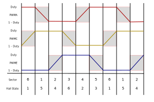

In a BLDC (Brushless DC) motor, the rotor's position is typically divided into six sectors, each corresponding to a specific state of the Hall effect sensors. The control of the motor is achieved by appropriately energizing the stator windings in a sequence that creates a rotating magnetic field, which in turn causes the rotor to follow. The six sectors ensure that the motor phases are commutated correctly.

Here is a detailed explanation of the six sectors and the switching sequence for each sector. 

### Six Sectors of BLDC Motor

The six sectors are determined based on the Hall effect sensor outputs, which change as the rotor rotates. The Hall sensors provide three signals (H1, H2, H3), which can be interpreted as a 3-bit binary code. Each unique combination of these signals corresponds to one of the six sectors.

In code this is done with :  

``` hall_state = hall1_value + 2*hall3_value + 4*hall2_value; ```  

Note that this should be adapted depending on the way phases and hall effect sensors are connected to the inverter. It might be necessary to permute the hall
values to run the motor correctly.  

### Controling the motor

Voltage applied to the motor windings is proportional to the duty cycle.  
 
```Vwindings = 2 * (Duty_cycle - 0.5) * Vdc```

In this example duty_cycle can be increased or lowered by pressing `u` and `d` in the serial monitor. 
It should directly affect motor speed.

### Commutation Sequence

The commutation sequence involves energizing pairs of motor phases (A, B, C) while leaving one phase floating. This creates a magnetic field that moves the rotor to the next position. The table below shows the state of the switches for each sector. 

- "1" indicates the switch is on.
- "0" indicates the switch is off.
- The phases are labeled as A, B, and C.

#### Switch Notation
- U: Upper switch
- L: Lower switch
- A, B, C: Phases

### Phase implementation 

| Electrical Phase | PWM       | LEG       |
|------------------|-----------|-----------|
| Phase A          | PWMA      | LEG1       |
| Phase B          | PWMC      | LEG2       |
| Phase C          | PWME      | LEG3       |

### Commutation Table

| Hall Sensors | Sector | Switch U_A | Switch L_A | Switch U_B | Switch L_B | Switch U_C | Switch L_C |
|--------------|--------|------------|------------|------------|------------|------------|------------|
| 101          | 1      | 0          | 0          | 1          | 0          | 0          | 1          |
| 100          | 2      | 0          | 1          | 1          | 0          | 0          | 0          |
| 110          | 3      | 0          | 1          | 0          | 0          | 1          | 0          |
| 010          | 4      | 0          | 0          | 0          | 1          | 1          | 0          |
| 011          | 5      | 1          | 0          | 0          | 1          | 0          | 0          |
| 001          | 6      | 1          | 0          | 0          | 0          | 0          | 1          |

*Commutation table*.

This sequence ensures that the magnetic field rotates in such a way that the rotor is pulled along with it, allowing for smooth and efficient operation of the BLDC motor. Each transition between sectors corresponds to a change in the Hall sensor readings, which the control logic uses to determine the appropriate switches to energize.