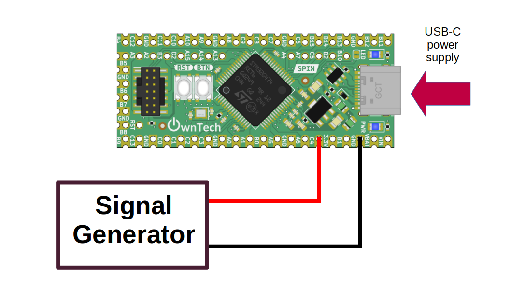
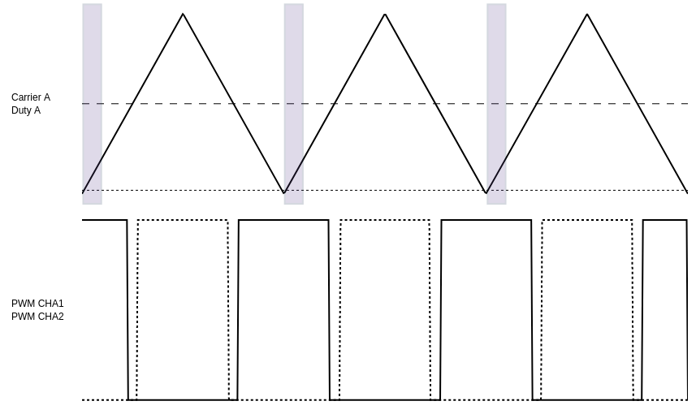

# Triggering measure from ADC via HRTIM trigger

An ADC, or Analog-to-Digital Converter, is a crucial component in modern electronics that converts continuous analog signals into discrete digital data. In simpler terms, it takes real-world phenomena, like sound or temperature, and turns them into numbers that a computer can understand and process. This conversion is essential for various applications, in power electronics it allows us to get real-time measures from the circuit like voltage and current. 

The spin uses the stm32G4 MCU, which has a high resolution timer (HRTIM) which can produce high resolution PWM. This example will show you how to use the HRTIM in order to trigger the measures. 

## Hardware setup and requirements


*figure 1*

You will need : 

- 1 spin
- A usb-c cable to supply power to the spin, and also upload the code from computer
- A signal generator to create a waveform to measure it from ADC, it can be sinewave, triangle wave...etc. This signal must between **0V and 2.048V**

Connect the signal generator to pin C4, and gnd. 

## Software setup 

The HRTIM has 6 differents timer (A,B,C,D,E,F) but you can choose up to two of them to trigger the measures. In this example we'll show you how you can use one of them **the timer A**.

On the picture below, you can see the waveform of the timer A pwm, the carrier, the duty cycle and the colored zone represents the timing where the measures is trigerred. 


*figure 2*

The measure is triggered with the same frequency as the switching frequency, the measure is done around the trough of the carrier on the positive slope. We will explain here which functions to call to setup the ADC trigger. 

First of all, we start by initializing the PWMA : 

```cpp
    spin.pwm.setFrequency(200000); // Set frequency of pwm

    spin.pwm.setModulation(PWMA, UpDwn); // Modulation mode, here up-down (triangle wave carrier)
    spin.pwm.setAdcEdgeTrigger(PWMA, EdgeTrigger_up); // Trigger on the positive slope

    spin.pwm.initUnit(PWMA); // timer initialization
```
The function `setAdcEdgeTrigger` allows us to choose where we want to trigger the measures : on the positive slope (EdgeTrigger_up) of the carrier like in fig.2, or the negative slope (EdgeTrigger_down) of the carrier.

After the initialization of the PWM, we can link it to a trigger : 

```cpp
    spin.pwm.setAdcTrigger(PWMA, ADCTRIG_1); // PWMA is linked to ADCTRIG_1
    spin.pwm.setAdcTriggerInstant(PWMA, 0.06); // set the trigger instant
    spin.pwm.enableAdcTrigger(PWMA); // enable the trigger
```
We are linking PWMA to a trigger, here ADCTRIG_1. There is a total of 4 trigger possible ADCTRIG_1, ADCTRIG_2, ADCTRIG_3 et ADCTRIG_4. However, there is only two that works for data acquisition currently : ADCTRIG_1 and ADCTRIG_3.

`setAdcTriggerInstant` will set the moment when we trigger a measure with a parameter between 0 (corresponding to the trough of the carrier)and 1 (corresponding to the crest of the carrier). Here we took 0.06, so we'll get the data around the trough of the carrier (as we have seen on fig.2)

And finally, we set the ADC2 to be set by the ADCTRIG_1, hrtim_ev1 means hrtim external event 1 which is ADCTRIG_1. 

```cpp
    spin.adc.configureTriggerSource(2, hrtim_ev1); // ADC 2 configured to be triggered by the PWM
```
We use the 5th channel of the adc, which is the gpio C4 on the spin (also numbered as pin 35). To enable the acquisition from this pin, we use the function `enableAcquisition`: 

```cpp
data.enableAcquisition(2, 35) // Enable acquisition for ADC2, for channel 5 (localized in GPIO C4 / pin number 35)
```
When we want to retrieve measures from ADC2 all we need to do is trigger ADC2 and retrieve measured value in GPIO C4 / pin number 35 :

```cpp
   spin.data.triggerAcquisition(2);
    adc_value =spin.data.getLatestValue(2, 35);
```

There is a total of 8 possible pin from where you can get analog measures :

| GPIO | PIN number | ADC and channels                |
|------|------------|---------------------------------|
| PC4  | 35         | ADC2 channel 5                  |
| PA1  | 30         | ADC1 channel 2 / ADC2 channel 2 |
| PA0  | 29         | ADC1 channel 1 / ADC2 channel 1 |
| PC3  | 27         | ADC1 channel 9 / ADC2 channel 9 |
| PC2  | 26         | ADC1 channel 8 / ADC2 channel 8 |
| PC1  | 25         | ADC1 channel 7 / ADC2 channel 7 |
| PC0  | 24         | ADC1 channel 6 / ADC2 channel 6 |
| PB15 | 6          | ADC4 channel 5                  |

You can also use ADCTRIG_3 to have PWMC trigger another ADC and get another measure. Below, we reproduce the same step but by using the ADC1 channel 2 localized on PA1 (pin number 30).

start PWMC :

```cpp
    spin.pwm.setFrequency(200000); // Set frequency of pwm

    spin.pwm.setModulation(PWMC, UpDwn); // Modulation mode, here up-down (triangle wave carrier)
    spin.pwm.setAdcEdgeTrigger(PWMC, EdgeTrigger_up); // Trigger on the positive slope

    spin.pwm.initUnit(PWMC); // timer initialization
```
link ADCTRIG_3 to PWMC : 

```cpp
    spin.pwm.setAdcTrigger(PWMC, ADCTRIG_3); // PWMA is linked to ADCTRIG_1
    spin.pwm.setAdcTriggerInstant(PWMC, 0.06); // set the trigger instant
    spin.pwm.enableAdcTrigger(PWMC); // enable the trigger
```
then set ADC1 channel 5 to be trigerred by ADCTRIG_3 : 

```cpp
    spin.adc.configureTriggerSource(1, hrtim_ev3); // ADC 2 configured to be triggered by the PWM
   spin.data.enableAcquisition(1, 30); // ADC 2 enabled
```

Finally you can retrieve data from the ADC : 

```cpp
   spin.data.triggerAcquisition(1);
    adc_value =spin.data.getLatestValue(1, 30);
```

## Expetected results

The analog value measured from the adc is stored inside the variable `adc_value`, which is printed in the serial monitor every 100ms you can then watch the measured on [ownplot](https://github.com/owntech-foundation/OwnPlot). 

If everything went correctly, you should observe the same waveform on ownplot that you generate via the signal generator. 