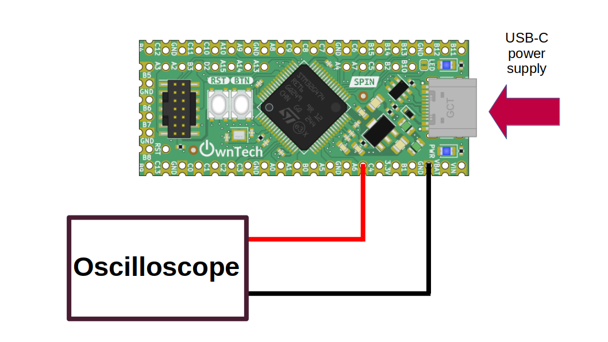

# Generating waveform with DAC

A DAC, or Digital-to-Analog Converter, converts digital signals into corresponding analog signals. It achieves this by assigning digital values to specific voltage, effectively generating continuous analog waveforms from discrete digital data. This functionality makes DACs essential for generating various waveforms in electronic systems.

## Hardware setup and requirements


*figure 1*

You will need: 

- 1 SPIN
- A USB-C cable to supply power to the SPIN, and also upload the code from a computer
- An oscilloscope to watch the DAC output

Connect the oscilloscope to GPIO PA6 (the DAC output).

## Software setup 

In this example we will use DAC 2 channel 1 to output a sawtooth signal. 

We start by initializing the DAC :

```cpp
    spin.dac.initConstValue(2); // DAC 2 initialization
    spin.dac.setConstValue(2, 1, 0); // Setting DAC 2 channel 1 to 0
```

The function `setConstValue` will convert a numerical value (from 0 to 4096) to a voltage (between 0 and 2.048) with the DAC. 

In the background task (called every 100 ms), the code increases the value sent to the DAC: 

```cpp
    dac_value = (dac_value + 100)%4096;
    spin.dac.setConstValue(2, 1, dac_value);
```

You can also reproduce the same step to use DAC1 channel 1 localized in GPIO PA4.


## Expected result

You should see a sawtooth on the DAC output.
