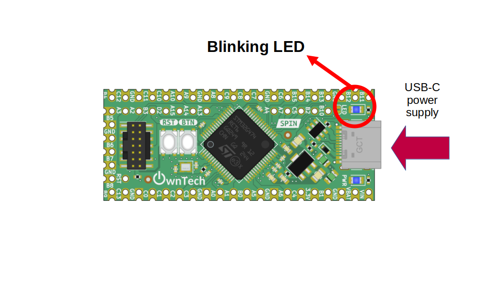

# Blinking an LED

Here is a simple example to start with SPIN: making an LED blink.

## Hardware setup and requirements


*figure 1*

You will need: 

- 1 SPIN
- A USB-C cable to supply power to the SPIN, and also upload the code from a computer

## Software setup

The LED is toggled in the background task called every 1 s, which means the LED will blink at the rate of 1 s. 

```cpp
    spin.led.toggle();
```

## Expected result 

Visual result: the LED should turn on and off. 
