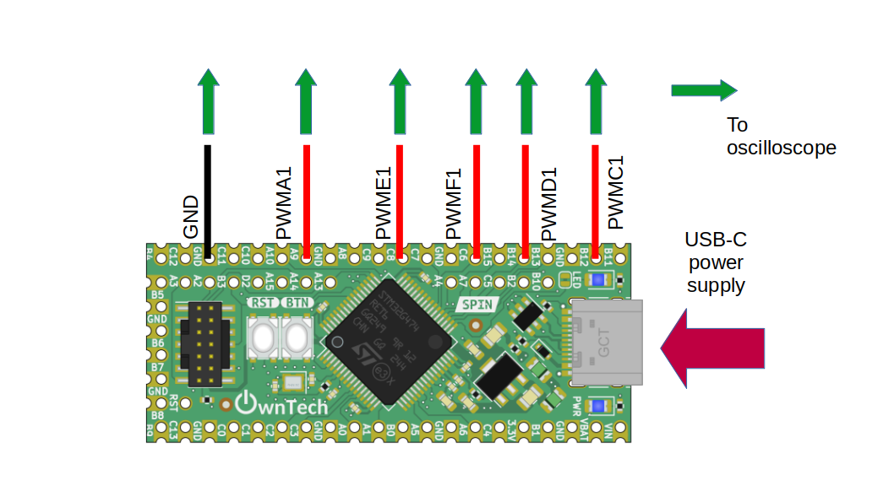

# Working with multiple PWM

The spin has a total of 5 PWM channels with 2 complementary output each. In this example, we'll detail how to use each of them.

## Hardware setup and requirements

*figure 1*

You will need :

- A spin
- A usb-c cable to supply the spin
- An oscilloscope to watch PWM waveform

We can watch :

-PWMA1 on gpio A8
-PWMC1 on gpio B12
-PWMD1 on gpio B14
-PWME1 on gpio C8
-PWMF1 on gpio C6

## Software setup

This example is initializing every PWM, and making a phase shift 77° (= 360/5°) as if we working in interleaved mode. See the [ phase shift ](../phase_shift/README.md) example for more details.

The duty cycle is the same for both PWMA and PWMC.

You can control the duty cycle from the serial monitor :
- press `u` to increase the duty cycle
- press `d` to decrease the duty cycle

See [ownplot](https://github.com/owntech-foundation/OwnPlot) if you would like a better graphical interface for the serial monitor.

## Expected result

You should observe 5 PWM with a phaseshift of 77° between them.