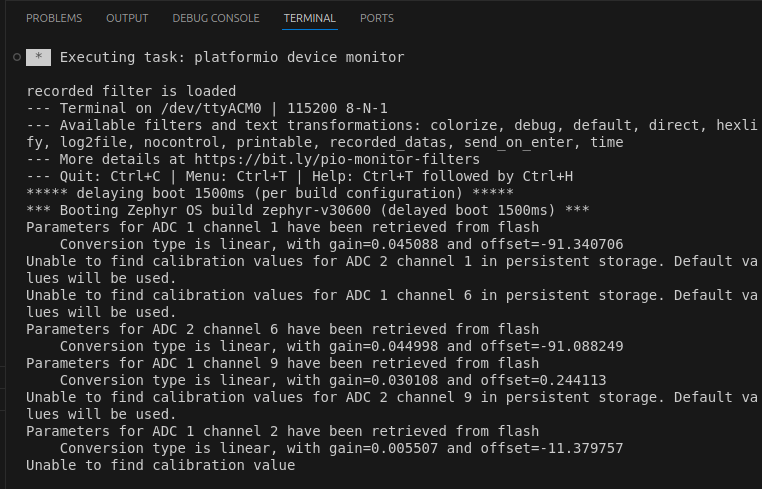

# Open Loop PWM

The goal of this basic example is to understand what is a duty cycle and how it is related to power flow. We will use our TWIST as a buck converter in an open-loop to divide our voltage by 2.

!!! warning "Are you ready to start ?"

    Before you can run this example, you must have : 
    
    - successfully gone through our [getting started](https://docs.owntech.org/core/docs/environment_setup/) tutorial to set up your work environment
    - successfully gone through our [first example](https://docs.owntech.org/latest/core/docs/first_example/) tutorial and download the "Open Loop PWM" example 

## Background
-----------

### What is a PWM ?

PWM or Pulse-Width-Modulation is based on the idea that a periodic (repetitive) logic signal (ON/OFF or 0/1) can have its width changed over time. This is shown on the three images below, where you can see the width of the $T_{ON}$ changing from `25%` to `75%` of the total period.

As shown in , the duty cycle is `25%` of the total time (`T`), is called `period`. 

{ #fig-duty-25 width=500}
{ #fig-duty-25 width=500 }

In figures  and  you can see the duty cycle again, but for a different **width**. Thus, "modulating the width" in practice means changing the duty cycle.  

{ #fig-duty-50 width=500}
{ #fig-duty-50 width=500}

{ #fig-duty-75 width=500}
{ #fig-duty-75 width=500}

### What is a duty cycle? 

The duty time is the ratio between the `ON` state and the period `T` of the logic signal. You can see it in the image above. It is defined by the  shown below. 

Equation: Definition of the duty cycle { #eq-test}

$$ D = \dfrac{T_{ON}}{T} $$ 

### What about power? 

In many fields, like electrical engineering, duty cycles are important to provide power efficiently and effectively for a specific situation. Many applications of motors, physical electronics, and even music use something called pulse width modulation or PWM to control the duty cycle and the necessary applied power (which can be referred to as input voltage or current). The duty factor plays a key role in representing the ratio of on time and off time for a given power supply.

A buck power converter will output a voltage that is the duty cycle times its input voltage. 
This is expressed by the equation: 

Equation: Buck converter voltage output as a function of the voltage input and duty cycle { #eq-test}

$$ V_{OUT} = D \cdot V_{IN}$$

This gives the following output for different input voltage values. 

{width=500 .on-glb}
{width=500 .on-glb}

### What is Deadtime?

In power electronics, switching between transistors is NOT instantaneous. To avoid short circuits, we provide a time between opening one switch and closing the other. This time is called **dead time**.

The deadtime can be of three formats: zero, positive or negative.

In zero deadtime, both PWM signal switches **simultaneouly** as shown in [] 

{ #fig-no-deadtime width=500}
{ #fig-no-deadtime width=500}

{ #fig-pos-deadtime width=500}
{ #fig-pos-deadtime width=500}

{ #fig-neg-deadtime width=500}
{ #fig-neg-deadtime width=500}

The length of the deadtime in either the rising or falling edges depends on the application.   

## Hardware setup and requirement
-----------

### Circuit diagram
The circuit diagram of the Twist board is shown in .
The Currents are represented by arrows and both legs are active. 
The power flows from `VHigh` to `VLow`.

{ #fig-circuit width=full .on-glb}
{ #fig-circuit width=full .on-glb}

### Wiring diagram
The wiring diagram is shown in .

!!! warning "Hardware pre-requisites" 
    
    You will need :

    - [1 TWIST board](https://www.owntech.io/twist/)
    - A dc power supply (20-60V)
    - A resistor (or a dc electronic load)
    - A USB-C cable

{ #fig-wiring width=full .on-glb}
{ #fig-wiring width=full .on-glb}

Once you have wired the cables are connected your TWIST board to your computer, you can upload the example code.  

!!! warning "Is you software ready?"
    Before you can run this example, you must have : 
    
    - successfully gone through our [getting started](https://docs.owntech.org/core/docs/environment_setup/) tutorial to set up your work environment
    - successfully gone through our [first example](https://docs.owntech.org/latest/core/docs/first_example/) tutorial and download the "Open Loop PWM" example 

## Main code structure
-----------

### Code structure 

Let's briefly explain the conde structure of the `main.cpp` file of this example. 

 shows a general representation of how the code is structured.

{ #fig-code-struct width=500 .on-glb}
{ #fig-code-struct width=500 .on-glb}

The code structure is as follows:

- On the top of the code some initialization functions take place.
- **Setup Routine** - initializes both legs in Buck mode, creates and starts the tasks of the example
- **Communication Task** - Handles the keyboard communication and decides which `MODE` is activated and if the duty cycle is incremented or decremented by `0.01`
- **Application Task** - Handles the `MODE`, activates the LED and prints the duty cycle value in the serial port 
- **Critical Task** - Handles the `MODE`, sets power ON/OFF and writes the duty cycle value to the PWM output

### Task timing diagram

The firmware of the TWIST board is executed according to the diagram in .

- **Communication Task** - Is awaken regularly to verify any keyboard activity
- **Application Task** - This task is woken once its suspend is finished. By default its period if of **100 miliseconds**. 
- **Critical Task** - This task is driven by the HRTIM count interrupt, where it counts a number of HRTIM switching frequency periods. In this case 100us, or 20 periods of the TWIST board 200kHz switching frequency set by default.

{ #fig-timing-diagram width=full .on-glb}
{ #fig-timing-diagram width=full .on-glb}

### Control scheme

There is no control scheme in this example. By default it is in `Open-loop`.

## Expected result
--------

!!! info "Build and Upload"
    
    - Build and Upload (+ ).
    
    - In the bottom toolbar, click on the Serial Monitor icon . Then click on the serial monitor screen. 

This code will control `duty_cycle` so that the voltage output will vary. You can control the duty cycle through platformio serial monitor. 

When opening it for the first time, the serial monitor will give you an initialization message regarding the parameters of the ADCs as shown below.  

!!! tip "Commands keys"
    Here are the command keys programmed by default in this example: 

    - press `p` to go into `POWERMODE` and turn on the output
    - press `i` to go into `IDLEMODE` and stop the power flow 
    - press `u` to increase the duty cycle by 0.05
    - press `d` to decrease the duty cycle by 0.05
    - press `h` to show the help menu

Here's sequence when the help menu is activated with `h`, the power mode is then activated with `p`, duty cycle is raised up to `0.5` and finally the Twist converter is put in idle with the `i`. 

You can measure the DC output voltage thanks to an oscilloscope or a multimeter.

That’s it!

???+ success "Contributors"

    - **2021.11.04**: Romain Delpoux, Loïc Quéval, Adrien Prévost
    - **2021.11.07**: Luiz Villa, Antoine Boche
    - **2022.01.24**: Luiz Villa, Loïc Quéval
    - **2022.02.01**: Luiz Villa
    - **2022.03.13**: Luiz Villa
    - **2022.06.23**: Loïc Quéval
    - **2023.07.10**: Luiz Villa
    - **2023.10.09**: Mathilde Longuet
    - **2024.02.25**: Luiz Villa, Ayoub Farah
    - **2025.04.24**: Luiz Villa
    - **2025.05.15**: Luiz Villa
