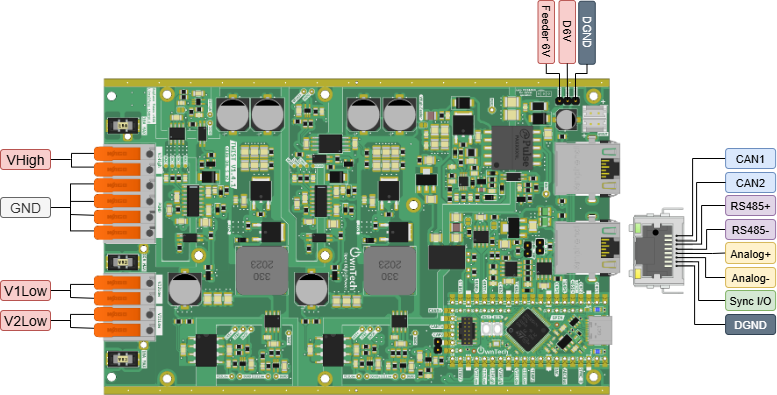
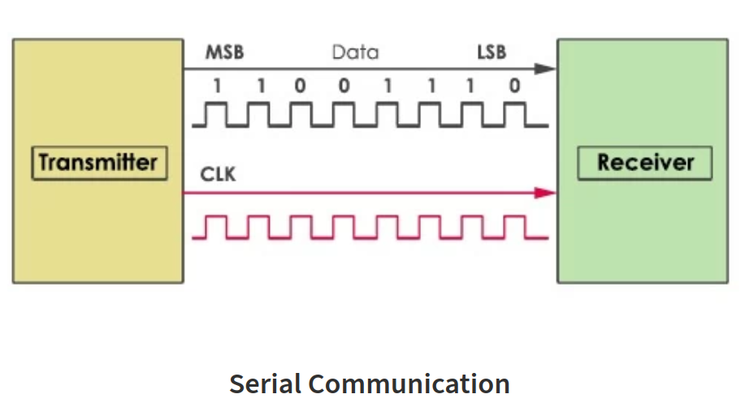
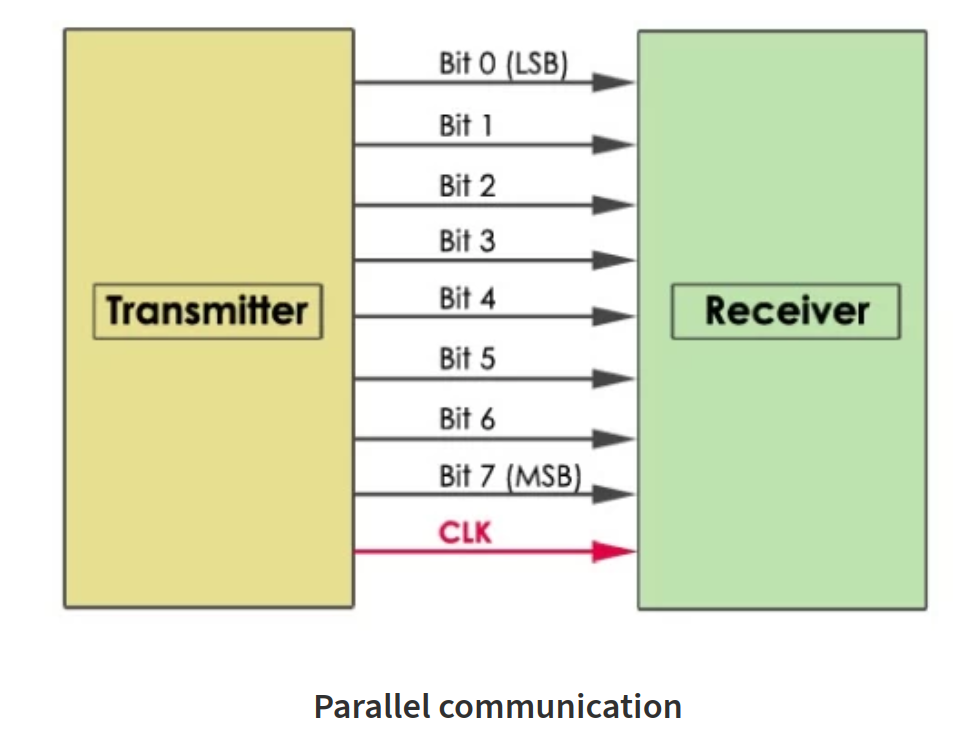
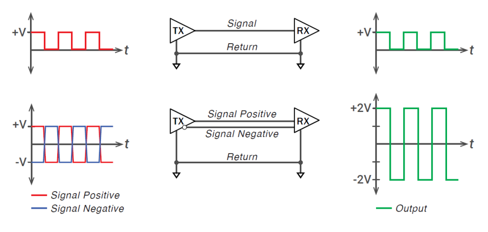
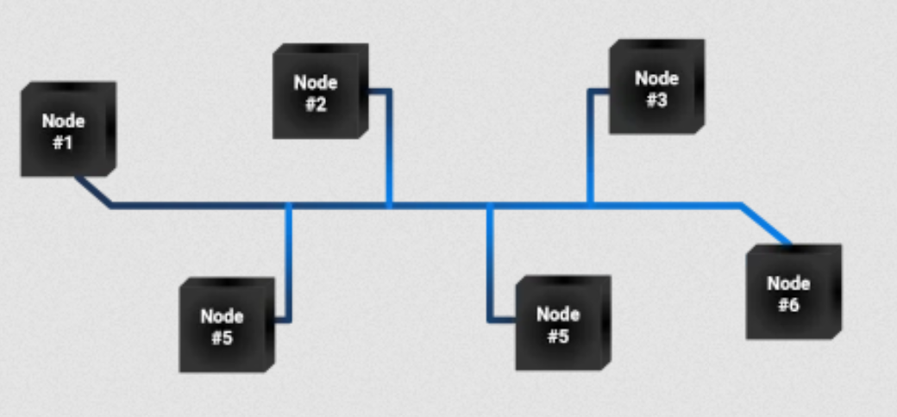
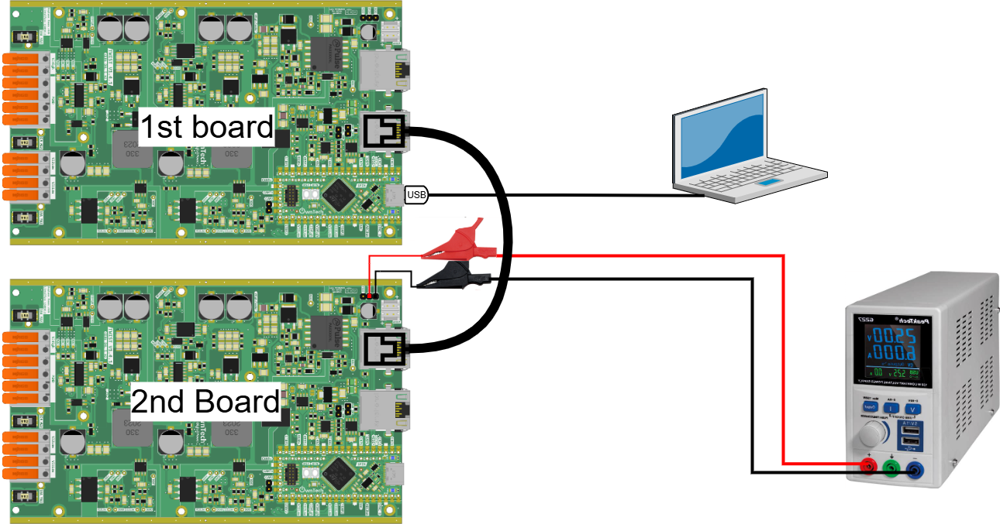
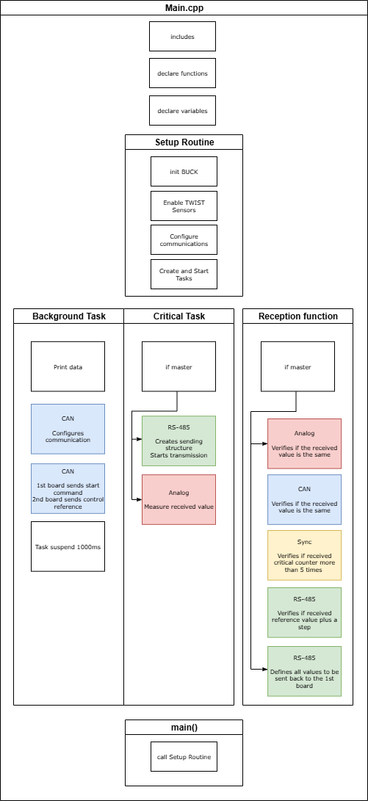
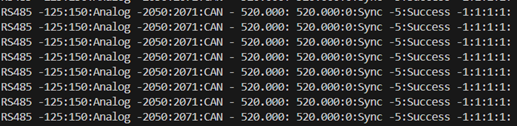

# Basic Communication Example
The goal of this example is to do a first communication test using two boards to understand how the different communications types are used in the Twist board.

The different communications are:
•	RS485
•	CAN
•	Analog
•	Sync

In this first example, two boards communicates via all three communication types plus Sync to verify if all communications are successful.

!!! attention Are you ready to start ?
    Before you can run this example, you must have successfully gone through the [getting started](https://docs.owntech.org/core/docs/environment_setup/). 

## RS-485 protocol introduction

RS-485 is a standard for serial communication that allows multiple devices to communicate over long distances using differential signaling on a twisted pair of wires.

In terms of speed, RS485 can go up to 20Mbits/s. This means that it would take 800 microseconds for 200 modules to exchange 10 bytes (80 bits) each at 20 Mbps
•	A voltage or a current measurement takes about 12 bits for example

But what is a serial communication? And a differential signaling?

In serial communications a bit is sent every clocks period.

In parallel communications a Data is sent multiple bits at once, each on its own wire.

A single-ended signal is sent on one wire, measured against ground, while a differential signal is sent on two wires, measured as the voltage difference between them. This makes differential signals more resistant to noise.

## CAN protocol introduction
CAN (Controller Area Network) is a robust serial communication protocol designed for reliable data exchange between microcontrollers and devices, especially in automotive and industrial systems.

In CAN protocol, all the modules (refered as nodes) are connected to a single communication bus.

The difference between can and RS-485 is that in CAN there is no risk of data collision (i.e. multiples nodes communicating at the same time). The data collision is avoided by setting a communication priority: if two nodes talk at the same time, the one with the smallest ID (identifier) has the priority.

In terms of speed, CAN go up to 1Mbits/s but there has been an improved version of the CAN called the FD-CAN that can go to 8Mbits/s. So we can say that RS-485 communication is faster but in counterpart has a risk of data collision if compared to CAN communication.

Further explanations on how to use this specific protocol with the Twist board are detailed in the CAN communication example README.

## Analog introduction
Analog (analogical communication) is a method of communication that sends or receives data using continuous signals, differently from RS485 and CAN signals that deals with digital discrete binary signals.

These continuous signals vary in amplitude, frequency and phase to represent data and can be, for example, currents, voltages, sound waves, etc. They are also well-defined at every time.

When we want to send a measurement via analog communication, the physical signal is converted into an analog signal by a transducer, such as the conversion of an acoustic wave into an electrical signal. The analog signal is going to be proportional to the physical signal it represents.

Analog communication depends of ADC analog-to-digital and DAC digital-to-analog converters to interface with digital systems.

## Hardware setup and requirement

The Hardware setup is shown in the figure below. You will connect the 2 boards using Ethernet cables and connect the second board to a 6 V power supply to feed its SPIN board during the tutorial.

!!! warning Hardware pre-requisites 
    You will need :
    - 2 TWIST boards with SPIN
    - 1 ethernet cable (RJ45)
    - 2 electronics jumpers
    - 2 alligator clips
    - 2 small banana cables
    - 1 USB-C cable
    - PC 64-bits (windows or linux)
    
## Main code structure

The `main.cpp` structure is shown in the image below.

The code structure is as follows:
- On the top of the code some initialization functions and variables definition take place
- **Setup Routine** - Calls functions that set the hardware and software, and configures the RS485, analog and sync communications
- **Background Task** - Prints result data showing if the communications are sucessful on the serial port. Also configures and handles CAN communication
- **Critical Task** - Handles RS485 and analog communication transmission and starts the test after 50 critical cycles

After the first board (sender) starts the transmission, the reception_function is used in the second board (receiver) to store the information and send a adapted response back to the first board. The first board then uses is own reception_function to store the information and verify if all communications were successful.

The tasks are executed following the diagram below. 

- **Background Task** - This task is woken once its suspend is finished. Same as Application Task.
- **Critical Task** - This task is driven by the HRTIM count interrupt, where it counts a number of HRTIM switching frequency periods. In this case 100us, or 20 periods of the TWIST board 200kHz switching frequency set by default.

### Successfulness test

The structure that is going to test is the communication is successful for all RS485, CAN, Analog and Sync is ConsigneStruct_t. The success criteria for each communication is:
- CAN: successful if the control reference sent by the master via CAN communication (CAN_control_reference) was sent back by the slave to the master via CAN communication (CAN_received_value).
- RS485: successful if the master receives the test_RS485 value it sent (125) + a step (25) added by the slave.
- Sync: sucessful if the control counter of the slave is sent to the master more than 5 times
- Analog: successful if the slave analog measure received by the master via RS485 is within 50 quantum of the original value sent by the master via analog communication.

Below we describe individually for each communication how it is implemented in the code.

#### CAN

The CAN communication is handled in the background loop:
1. First its enables the CAN control and Broadcasting
2. The first board stores the control reference sent by the second board via CAN and sends a start order to the second board so it continues to communicate with the first one via CAN.
3. The second board verifies if it received a start or a stop order. While it receives a start order, it keeps sending its control reference to the first board over CAN communication. The ctrl_slave_counter is updated each time the background loop is executed.

#### Analog
The Analog communication is handled in both setup_routine and critical_task functions:
1. The first board analog communication is initialized and configured to send the analog_value_ref value continuously.
2. The analog communication is initialized for the second board.
3. The second board measures the received message sent via analog communication and stores in the variable analog_value_receive that is latter sent back to the first board via RS485 communication for successfulness verification.

#### Sync
The Sync is handled in setup_routine function.

The synchronization is initialized in the setup_routine for both master and slave. With this configuration, the master sends a synchronization pulse to the slave in order to synchronize the boards timers.

#### RS-485
The RS-485 communication is handled in both setup_routine and critical_task functions. It is used to verify if all communications protocols are successful by checking if the values on the structure ConsigneStruct_t sent by the slave to the master are equal to expected.
1. RS-485 is configured in the first board. The communication structure sent and received are both of type ConsigneStruct_t.In RS-485 communication, buffer_tx and buffer_rx are pointers to the transmitted buffer (tx_consigne) and pointer to the received buffer (rx_consigne), respectively. The sent and received buffers tx_consigne and rx_consigne are also of type ConsigneStruct_t.
2. RS-485 is configured in the second board. The communication structure is also of type ConsigneStruct_t but reception_function is different than the one for the first board.
3. The communication is turned on.
4. The first board defines the reference value to be sent to the second board in the transmission buffer tx_consigne and starts transmission to the second board in the critical_loop.
5. The second board receives the transmitted message and its reception function slave_reception_function() is activated. It configures its transmission buffer according to the received messages from each communication:
- CAN: it sends if the CAN communication is maintained
- RS485: it sends back the received reference value of 125 + a step of 25
- Sync: it sends the critical function periods counter
- Analog: it sends the measured received value from analog communication
6. The second board starts transmission to the first board.
7. The first board receives the message and its reception function master_reception_function() is activated. It performs the tests to verify if the communications were successful.

A more fluid explanation with code snippets is available at [Communication tutorial](https://github.com/analuhaas/tutorial-TWIST-SPIN/blob/main/Tutorial_Twist_Board_Communications_HAAS_20250808.docx)

## Expected results

First Build and Upload the code into the 4 boards changing the variable master to true or false according to the board function.

You can control the mode through platformio serial monitor. The image below shows you a snippet of the window and the button to press.

Follow this step-by-step to perform the tutorial:
1.	Turn on the power supply of the second board at 6 V.
2.	Open the serial monitor while connected with the first board via the USB-C cable and verify the printed results.
3.	When finished, turn off the 6 V power supply and disconnect the USB-C cable.

You expect to see the all communications to be succeeded. If not, maybe tge communication cables are not well connected.

