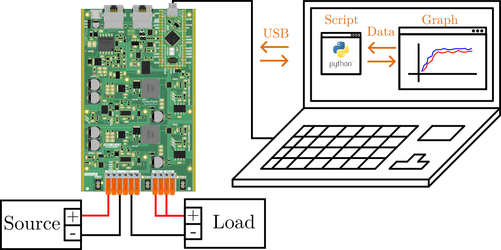
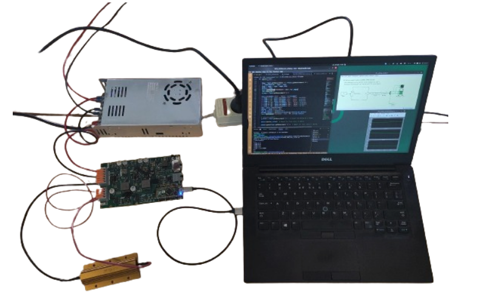

# Python Communication Protocol

This example uses the python communication protocol library to drive a Twist 1.4.1 board in Buck mode.

The script will send data to the board, retrive the measurements and show them on a graph.

!!! danger Advanced example
     This is an advanced example. Make sure you are comfortable with using the [voltage mode](https://docs.owntech.org/examples/TWIST/DC_DC/buck_voltage_mode/) **before** doing this emulator.


## Hardware wiring and requirement

The wiring of the system is given by the image below:
- The power converter is connected in `buck` mode with a source and a load.
- `LEG1` and `LEG2` are connected in parallel on the low side, as shown in the figure below.
- The converter is connected to the computer via its USB connector.



You will need :
- 1 TWIST (it works with the OWNVERTER too!)
- 1 dc power supply (20-60V)
- 1 power load
- 1 PC

!!! warning Make sure you read this readme all the way to the end

## Embedded Firmware setup

We import the `communication_library` in `platformio.ini` via the line. Be careful to include the `#power_tuesday` at the end, since it will get the right version of the protocol :

```ini
lib_deps=
    comm_protocol = https://github.com/owntech-foundation/python_twist_comm_protocol.git#power_tuesday
```

## Embedded Firmware explanation

The emebedded firmware will configure the `TWIST` or `OWNVERTER` board to be able to communicate with your computer via python. 

The software deploys a communication system with three modes:

1. **IDLE**
   - :dart: in the application_task: stops broadcasting data
   - :zap: in the critical_task: stops the power flow

2. **POWER_OFF**
   - :dart: in the application_task: broadcasts system status data on the serial port
   - :zap: in the critical_task: stops the power flow

3. **POWER_ON**
   - :dart: in the application_task: broadcasts sensor data on the serial port together with other data
   - :zap: in the critical_task: starts the power flow, controls the power flow with a PID

!!! Tip How the system works
    Characters are sent via the Serial port to the `SPIN` board.
    It parses these characters and decides which value to put in which variables that describes the power converter.
    For more details, please checkout the [communication protocol library readme](https://github.com/owntech-foundation/python_twist_comm_protocol)


## Python script

The Python code handles communication, the voltage reference and plotting the data from the board.

It will send a triangular waveform to the board and plot it in real-time.

!!! tip How the communication works
    The script sends out a frame that is pre-structured to be parsed by the C code.
    For instance:

    ```python
    Twist.sendCommand("LEG","LEG1","ON")
    ```
    Translates to

    ```bash
    s_LEG1_b_on
    ```

    The `communication_task` on the Twist board will get the first character of the message using `console_getchar()`. And then it will call a handler using `initial_handle`.

    ```c
      void loop_communication_task()
      {
          received_char = console_getchar();
          initial_handle(received_char);
      }
    ```

    The handler will decide what the message is about and then update the appropriate structure of the communicaiton protocol that handles the information.

    Which activates the power leg `LEG1`.


## Hardware setup

This code was tested using the following hardware setup:



On the photo:
  - A computer running the `comm_script.py` python script.
  - A Twist board connected in Buck mode.
  - A voltage source.
  - A resistor connected to `LEG1` and `LEG2`
  - `LEG1` and `LEG2` connected in parallel.

## How to use this example

Before running the code

!!! warning Make sure you have:
    - `python` installed in your computer.
    - that you follow the [firmware setup instructions](#embedded-firmware-setup) and have the appropriate libraries listed in `platformio.ini`.
    - flash the `main.cpp` in your Twist board

Once all of the above are ok, you can then run the `comm_script.py` script with your python3.
