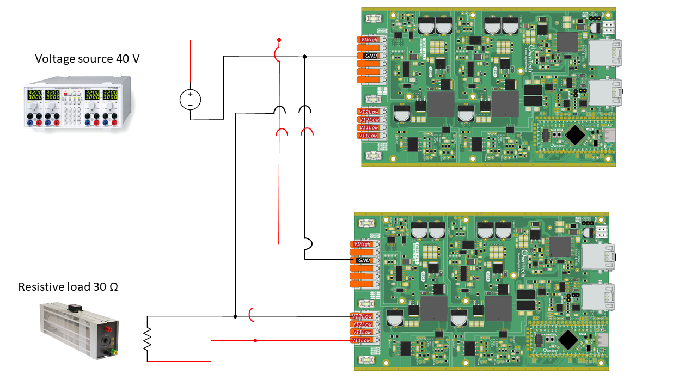

# Ac current source follower

In this example you need to have a first Twist with the [Grid Forming](../grid_forming/README.md) example.

<div style="text-align:center"></div>

The parameters are:

* $U_{DC} = 40 V$
* $R_{LOAD} = 15 \Omega$.


In the second Twist we use a software phase locked loop ( _"pll"_ ).
By this way we are synchronised with the grid voltage and we can then inject current
with a power factor of one. The current is regulated using a proportional resonant (_"pr"_)
regulator.

the _"pll"_ and _"pr"_ are provided by the OwnTech control library which must be included 
in the file `platfomio.ini`.

```
lib_deps=
    control_lib = https://github.com/owntech-foundation/control_library.git
```

The voltage source is defined by the voltage difference: $U_{12} = V_{1low} - V_{2low}$.

Link with the duty cycle:

* The leg1 is fixed in buck mode then: $V_{1low} = \alpha_1 . U_{DC}$
* The leg2 is fixed in boost mode then: $V_{2low} = (1-\alpha_2) . U_{DC}$

We change at the same time $\alpha_1$ and $\alpha_2$, then we have : $\alpha_1 = \alpha_2 = \alpha$. <br>
And then: $U_{12} = (2.\alpha - 1).U_{DC}$

$\alpha = \dfrac{U_{12}}{2.U_{DC}}  + 0.5$

