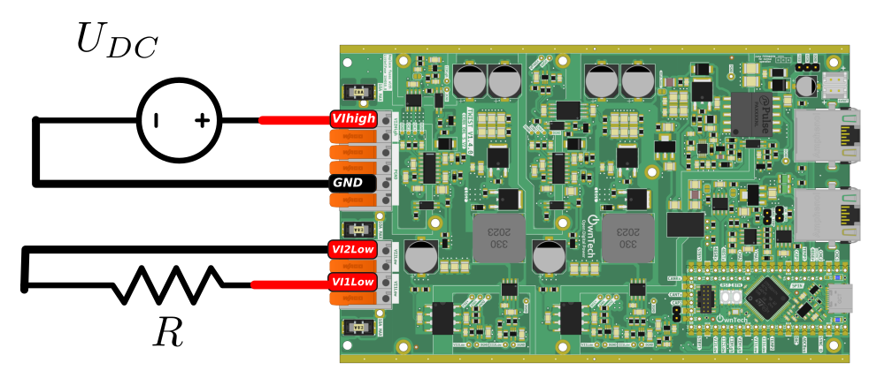

# AC Voltage Source

In this example we build an AC voltage source using a TWIST and supply a resistor.

<div style="text-align:center"></div>

The parameters are:

* $U_{DC} = 40 V$
* $R_{LOAD} = 30 \Omega$.

## Software overview

### Import libraries
This example depends on two libraries:

1. control_library
2. ScopeMimicry

To use them, you have to add the following lines in the `platformio.ini` file:
```
lib_deps=
    control_library = https://github.com/owntech-foundation/control_library.git
    scope = https://github.com/owntech-foundation/scopemimicry.git 
```

### Define a regulator

The voltage regulation will be done by a proportional resonant regulator.
This component is provided by the OwnTech control library `control_lib`.

The Proportional Resonant regulator is initialized with the lines above:

```cpp
PrParams params = PrParams(Ts, Kp, Kr, w0, 0.0F, -Udc, Udc);
prop_res.init(params);
```

The parameters are defined with these values:

```cpp
static Pr prop_res; // controller instantiation. 
static float32_t Kp = 0.02F;
static float32_t Kr = 4000.0F;
static float32_t Ts = control_task_period * 1.0e-6F;
static float32_t w0 = 2.0 * PI * 50.0;   // pulsation
static float32_t Udc = 40.0F;
```

## Run the example

!!! tip Finger on the trigger

    To capture the current ripple you have to follow these steps:
    - press the **`p`** key to go in `POWER_MODE`
    - press the **`t`** key to activate the trigger of the `ScopeMimicry` instance.
    - press the **`i`** key to come back in `IDLE_MODE`
    - press the **`r`** key to retrieve the data.


After these steps you should see in your directory a new folder called `Data_records` appear.
Within it you will find three files with the following naming convention: 

- `Year-month-day-hour-minute-second.txt` - a raw data file
- `Year-month-day-hour-minute-second.csv` - a post-processed CSV file
- `Year-month-day-hour-minute-second.png` - an automatically generated png file

As an example here are two acquisitions:


In the code there's some parameters you can change:
- `num_trig_ratio_point`: it sets the number of trig_ratio values that will be swept
  between `begin_trig_ratio` and `end_trig_ratio`
- `begin_trig_ratio` : beginning value of the sweep.
- `end_trig_ratio`: end value of the sweep.


### To view some variables
After stopping, i.e. in IDLE mode, you can retrieve some data by pressing `r`. It calls a
function `dump_scope_datas()` which sends to the console variables recorded during
the power flow phase.


## Link between voltage reference and duty cycles.
The voltage source is defined by the voltage difference: $U_{12} = V_{1low} - V_{2low}$.

Link with the duty cycle:

* The leg1 is fixed in buck mode then: $V_{1low} = \alpha_1 . U_{DC}$
* The leg2 is fixed in boost mode then: $V_{2low} = (1-\alpha_2) . U_{DC}$

We change at the same time $\alpha_1$ and $\alpha_2$, then we have : $\alpha_1 = \alpha_2 = \alpha$. <br>
And then: $U_{12} = (2.\alpha - 1).U_{DC}$

$\alpha = \dfrac{U_{12}}{2.U_{DC}}  + 0.5$
