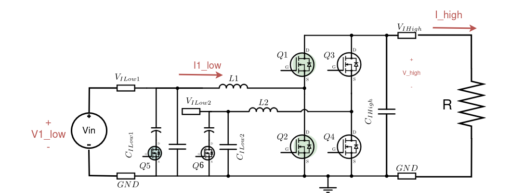
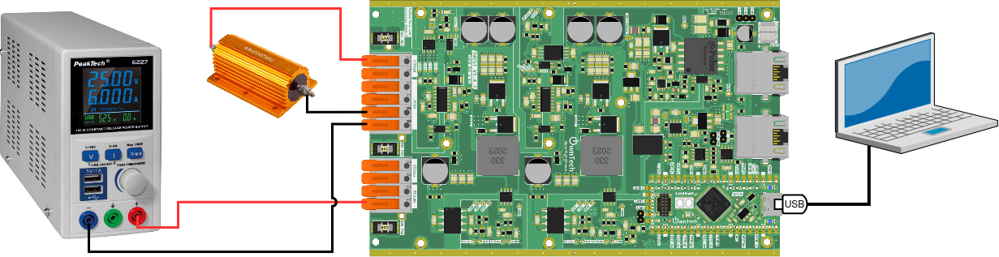
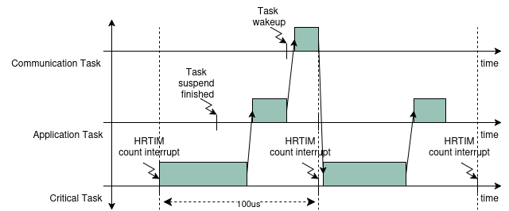
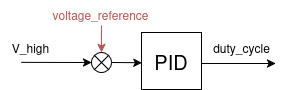

# Boost with PID controlled output voltage

A voltage mode boost converter regulates voltage by comparing the output voltage to a reference voltage. It adjusts the duty cycle of its switching signal to keep the output voltage stable. This type of converter efficiently steps up voltage levels, making it useful in various electronic devices such as converting photovoltaic panel voltage.

This example will implement a voltage mode boost converter to control the output.


## Hardware setup and requirement

The circuit diagram of the board is shown in the image below.




The power flows from `V1Low` to `V_high`. The wiring diagram is shown in the figure below.





You will need :
- 1 TWIST
- A dc power supply (**max 10V**)
- A resistor (or a dc electronic load)

## Software setup and structure

The example is built using the `main.cpp` file and the `control` library.

#### Main code structure

The `main.cpp` structure is shown in the image below.


The code structure is as follows:
- On the top of the code some initialization functions take place.
- **Setup Routine** - calls functions that set the hardware and software
- **Communication Task** - Handles the keyboard communication and decides which `MODE` is activated
- **Application Task** - Handles the `MODE`, activates the LED and prints data on the serial port 
- **Critical Task** - Handles the `MODE` sets power ON/OFF and track the `V_high` variable with a `PID`

The tasks are executed following the diagram below. 





- **Communication Task** - Is waken regularly to verify any keyboard activity
- **Application Task** - This task is woken once its suspend is finished 
- **Critical Task** - This task is driven by the HRTIM count interrupt, where it counts a number of HRTIM switching frequency periods. In this case 100us, or 20 periods of the TWIST board 200kHz switching frequency set by default.


#### Control scheme

The control library is imported in platformio.ini via the line :

```
lib_deps=
    control_lib = https://github.com/owntech-foundation/control_library.git
```

We can use this library to initialize a PID control with the function :

```cpp
pid.init(pid_params);
```

The control diagram of the `PID` is shown in the figure below.




## Expected result

This code will control the output voltage to have 15V, you can control the output voltage with the serial monitor :

- press `u` to increase the voltage reference by 0.5V
- press `d` to decrease the voltage reference by 0.5V

The following plot shows the expected result. Here the voltage reference was modified and `V_High` can be seen to follow it. 
Both currents are negative, as the current measurement `I_High` is in the `load` convention and the current measurement `I1_low` is in `source` convention.  


