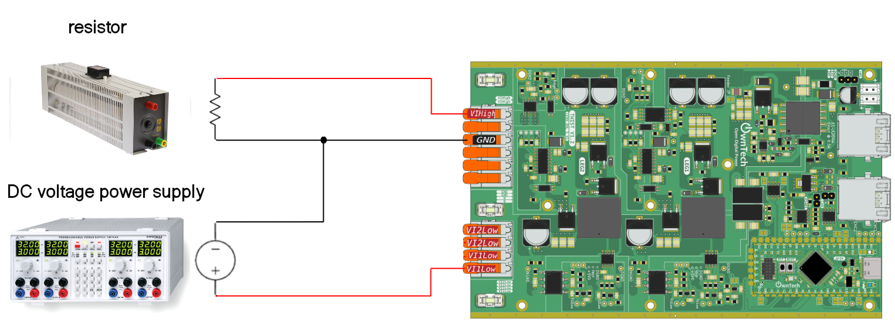

# Boost with PID controlled output voltage

A voltage mode boost converter regulates voltage by comparing the output voltage to a reference voltage. It adjusts the duty cycle of its switching signal to keep the output voltage stable. This type of converter efficiently steps up voltage levels, making it useful in various electronic devices such as converting photovoltaic panel voltage.

This example will implement a voltage mode boost converter to control the output.


## Hardware setup and requirement




You will need :
- 1 TWIST
- A dc power supply (**max 10V**)
- A resistor (or a dc electronic load)

## Software setup

We import the OwnTech control library with platformio.ini via the line :

```
lib_deps=
    control_lib = https://github.com/owntech-foundation/control_library.git
```

We can use this library to initialize a PID control with the function :

```cpp
pid.init(pid_params);
```

the initial parameters are :

```cpp
static Pid pid; // define a pid controller

static float32_t kp = 0.000215;
static float32_t Ti = 7.5175e-5;
static float32_t Td = 0.0;
static float32_t N = 0.0;
static float32_t upper_bound = 1.0F;
static float32_t lower_bound = 0.0F;
static float32_t Ts = control_task_period * 1.e-6F;
static PidParams pid_params(Ts, kp, Ti, Td, N, lower_bound, upper_bound);
```

## Expected result

This code will control the output voltage to have 15V, you can control the output voltage with the serial monitor :

- press `u` to increase the voltage
- press `d` to decrease the voltage

