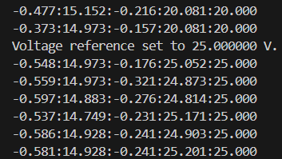

# Closed-loop Boost with typed voltage reference

The goal of this tutorial is to use the TWIST board to step up the output voltage. This time, we want to be able to manually change the output voltage by entering it directly into the serial monitor.

To do this, we start from the previous Boost voltage mode example and modify the code to have voltage reference input from the keyboard using the following variables to store the typed characters:

- received_serial_char : character typed by the user.
- buffer[4] : string that stores the input digits from the user. It can stock up to 3 digits + a null character \0 to finish the string.
- index : integer variable used to track the position on the buffer string.
- new_voltage_reference : float variable initialized at 0.0 the stocks the new voltage reference converted from buffer string.

How does it works : 
- During the communication_loop captures characters from the console and stores it until the Enter key (\n) is pressed.
- Only number digits (0–9) are stored in the buffer.
- After that the new_voltage_reference variable converts the entered string to an integer value using the function atoi.
- Into the if loop, if the entered value is between 0 and 30, the voltage_reference becomes new_voltage_reference

!!! warning "Are you ready to start ?"
    Before you can run this example, you must have successfully gone through our [getting started](https://docs.owntech.org/latest/core/docs/environment_setup/). 

## Hardware setup and requirement

The circuit diagram of the board is shown in the image below.

The power flows from `V1Low` to `V_high`. The wiring diagram is shown in the figure below.

You will need :
- 1 TWIST
- A dc power supply (**max 10V**)
- A resistor (or a dc electronic load)

## Expected result

While in power mode, when you type a number between 0 and 20 and type a enter in the end, you should have your voltage reference change like this:

