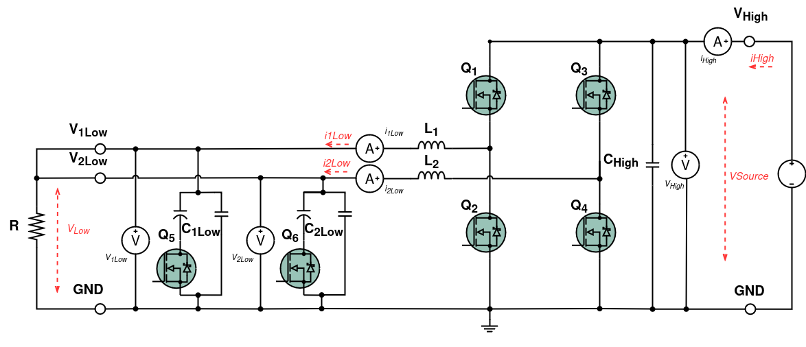
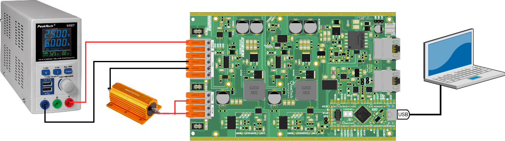
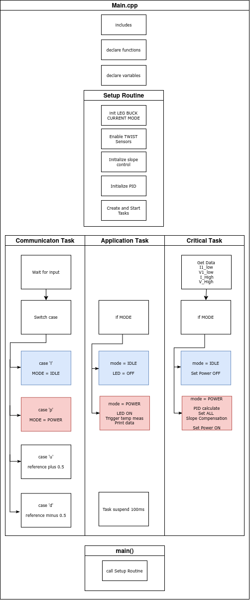
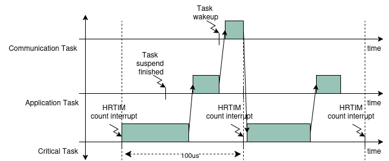
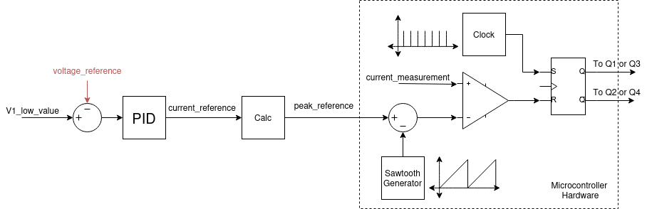
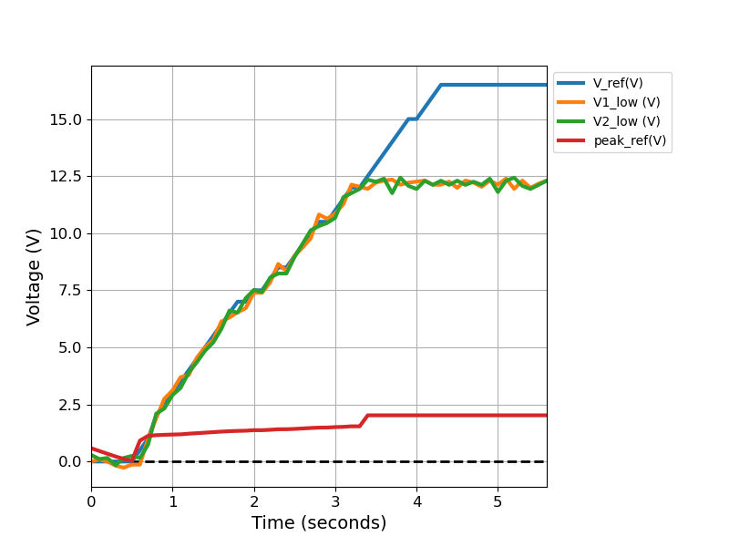

# Buck current mode

## Overview

A buck converter is a type of DC-DC converter used to efficiently regulate voltage levels. It works by converting a higher input voltage to a lower output voltage.

Peak current control mode is a technique used in DC-DC converters to regulate the output voltage. In this mode, the converter controls the output voltage by monitoring the peak current flowing through the inductor. During each switching period when the peak current reaches a set limit, the converter MOSFET switches off. This mode helps maintain stable output voltage by adjusting the duty cycle of the switching signal based on the peak current level, ensuring efficient and reliable power conversion in real-time.

!!! warning The Buck stops here 
    Currently current mode is only supported for **buck configuration**.

!!! warning "Are you ready to start ?"
    Before you can run this example:
    - you **must** have successfully gone through our [getting started](https://docs.owntech.org/latest/core/docs/environment_setup/).
    - ideally, you should have successfully gone through our [Voltage Mode Example](https://docs.owntech.org/latest/examples/TWIST/DC_DC/buck_voltage_mode/)  


## Hardware setup and requirement

The circuit diagram of the board is shown in the image below.




The power flows from `VHigh` to `VLow`. The wiring diagram is shown in the figure below.




!!! warning Hardwares pre-requisites
    You will need:
    - 1 twist
    - A DC power supply
    - A resistor (or a DC electronic load)

## Main Structure

The `main.cpp` structure is shown in the image below.



The code structure is as follows:
- On the top of the code some initialization functions take place.
- **Setup Routine** - calls functions that set the hardware and software. It has a special call for the current mode. 

    ```cpp
    /* Initialize buck with current mode*/
    shield.power.initBuck(ALL,CURRENT_MODE);
    ```

- **Communication Task** - Handles the keyboard communication and decides which `MODE` is activated
- **Application Task** - Handles the `MODE`, activates the LED and prints data on the serial port 
- **Critical Task** - Handles the `MODE`, sets power ON/OFF, calls the `PID` to create a current reference. It corrects the slope compensation of the current mode via a specific function call:
    ```cpp
    shield.power.setSlopeCompensation(ALL,PeakRef, PeakRef - 0.5);
    ```


The tasks are executed following the diagram below. 





- **Communication Task** - Is awaken regularly to verify any keyboard activity
- **Application Task** - This task is woken once its suspend is finished 
- **Critical Task** - This task is driven by the HRTIM count interrupt, where it counts a number of HRTIM switching frequency periods. In this case 100us, or 20 periods of the TWIST board 200kHz switching frequency set by default.


### Control diagram

The implementation of the current mode follows the model below.


_Source : STM32 AN5497_


The voltage measurement `V1_low_value` and the `voltage_reference` are given to the `PID` to calculate a `current_reference`. From it, a `peak_reference` is calculated and updated via a dedicated function. This updates the hardware setup of the microcontroller that compares the physical `current_measurement` to the compensated threshold. This comparator is connected to the reset of the HRTIM `latch`. 

When the current measurement is higher than the comparator reference, it will reset the HRTIM, bringing its output from 1 to 0.  

!!! note Source material
    We recommend you check [stm32 application note](https://www.st.com/resource/en/application_note/an5497-buck-current-mode-with-the-bg474edpow1-discovery-kit-stmicroelectronics.pdf) for more informations about current mode.


## Expected result

This code will control the output voltage to have 15V, you can control the output voltage with platformio serial monitor. The image below shows your a snippet of the window and the button to press.


When opening it for the first time, the serial monitor will give you an initialization message regarding the parameteres of the ADCs as shown below.  


!!! tip Commands keys
    - press `u` to increase the voltage
    - press `d` to decrease the voltage
    - press `h` to show the help menu

Here's sequence where: 
- the help menu is activated with `h`, 
- the power mode is then activated with `p` 
- the voltage reference is raised from `15 V` to `16 V`
- and finally the Twist converter is put in idle with the `i`. 


!!! note The data that you see
    When you send `p` the Twist board will send you back a stream of data on the following format: 
    
    ```c 
    voltage_reference:V1:V2:peak_reference
    ```
    Where: 
    - `Vref` is the reference voltage given to the Twist board for both legs on the `LOW` side
    - `V1` is the voltage in `LEG1` of the `LOW` side
    - `V2` is the voltage in `LEG2` of the `LOW` side
    - `IpeakRef` is the current reference calculated and given to both `LEG1` and `LEG2` of the `LOW` side

    For instance when you reveive this: 

    ```c 
    16.000:16.194:16.233:1.500:
    ```

    It means that `voltage_ref = 16 V`, `V1 = 16.194 V`, `V2 = 16.233 V` and `peak_reference = 1.5 V`. 

    If you plot your data with a python code, you should get something like the image below. You can see the voltages follow the reference, up until the saturation of the peak reference.   

    


