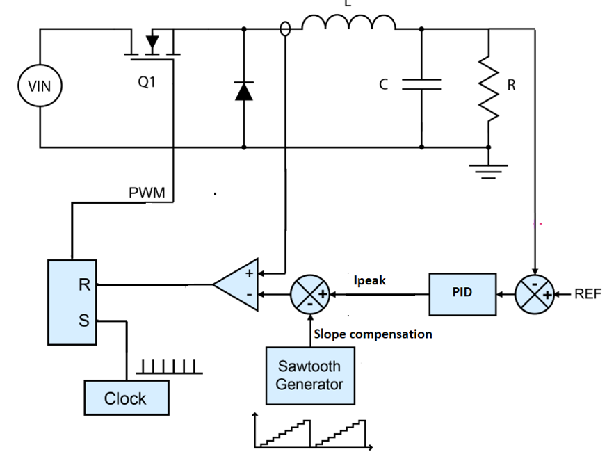

# Buck current mode

## Overview

A buck converter is a type of DC-DC converter used to efficiently regulate voltage levels. It works by converting a higher input voltage to a lower output voltage.

Peak current control mode is a technique used in DC-DC converters to regulate the output voltage. In this mode, the converter controls the output voltage by monitoring the peak current flowing through the inductor. During each switching period when the peak current reaches a set limit, the converter switches off. This mode helps maintain stable output voltage by adjusting the duty cycle of the switching signal based on the peak current level, ensuring efficient and reliable power conversion.

Currently only **buck configuration** is supported for current mode.

### Control diagram

The general implementation of the current mode follow this model.


_Source : STM32 AN5497_

check [stm32 application note](https://www.st.com/resource/en/application_note/an5497-buck-current-mode-with-the-bg474edpow1-discovery-kit-stmicroelectronics.pdf) for more informations about current mode.


### Requirement and schematic


You will need :

- 1 twist
- A DC power supply
- A resistor (or a DC electronic load)

## Software setup

We import `control_library` with platformio.ini via the line :

```
lib_deps=
    control_lib = https://github.com/owntech-foundation/control_library.git
```

We can use this library to initialize a PID control with the function :

```cpp
pid.init(pid_params);
```

the initial parameters are defined using the following lines :

```cpp
static Pid pid; // define a pid controller.

static float32_t Ts = control_task_period * 1.e-6F;
static float32_t kp = 0.000215;
static float32_t Ti = 7.5175e-5;
static float32_t Td = 0.0;
static float32_t N = 0.0;
static float32_t upper_bound = 1.0F;
static float32_t lower_bound = 0.0F;
static PidParams pid_params(Ts, kp, Ti, Td, N, lower_bound, upper_bound);
```

## Code overview
We initialize the leg control in buck current mode with the lines above: 

```cpp
 /* Initialize buck with current mode*/
    twist.initAllBuck(CURRENT_MODE);
```

### Important functions

For current mode, there are two specific functions to control the current of both legs.

```cpp
twist.setLegSlopeCompensation(LEG1, 1.4, 1.0);
twist.setLegSlopeCompensation(LEG2, 1.4, 1.0);
```

It sets in **volt** the higher and lower point of the sawtooth used for the slope compensation.
