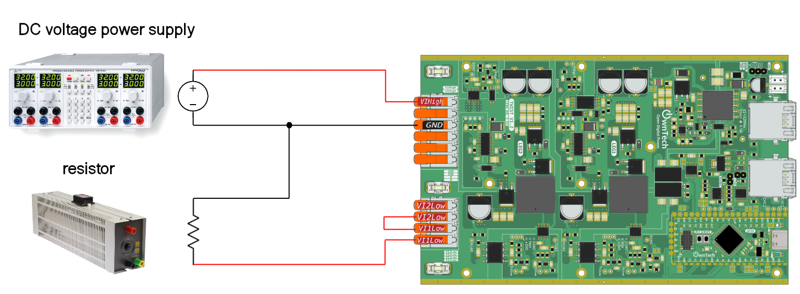
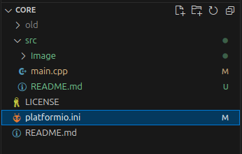

# Buck with PID controlled output voltage

A voltage mode buck converter regulates voltage by comparing the output voltage to a reference voltage. It adjusts the duty cycle of its switching signal to keep the output voltage stable. This type of converter efficiently steps down voltage levels, making it useful in various electronic devices like phone battery charger.

This example will implement a voltage mode buck converter to control the output.

!!! attention Are you ready to start ?
    Before you can run this example, you must have successfully gone through our [getting started](https://docs.owntech.org/core/docs/environment_setup/).  

## Hardware setup and requirement




You will need :
- 1 TWIST
- A dc power supply (20-60V)
- A resistor (or a dc electronic load)

## Software setup

Locate your `platformio.ini file` in your working folder.




We will import `control_library` in `platformio.ini` by decommenting the line :

```ini
lib_deps=
    #control_lib = https://github.com/owntech-foundation/control_library.git
```
It should look like this: 

```ini
lib_deps=
    control_lib = https://github.com/owntech-foundation/control_library.git
```

We can use this library to initialize a PID control with the function :

```cpp
pid.init(pid_params);
```

the initial parameters are defined using the following lines :

```cpp
#include "pid.h"
static Pid pid; // define a pid controller.

static float32_t Ts = control_task_period * 1.e-6F;
static float32_t kp = 0.000215;
static float32_t Ti = 7.5175e-5;
static float32_t Td = 0.0;
static float32_t N = 0.0;
static float32_t upper_bound = 1.0F;
static float32_t lower_bound = 0.0F;
static PidParams pid_params(Ts, kp, Ti, Td, N, lower_bound, upper_bound);
```

## Expected result

This code will control the output voltage to have 15V, you can control the output voltage with platformio serial monitor. The image below shows your a snippet of the window and the button to press.


When opening it for the first time, the serial monitor will give you an initialization message regarding the parameteres of the ADCs as shown below.  


!!! tip Commands keys
    - press `u` to increase the voltage
    - press `d` to decrease the voltage
    - press `h` to show the help menu

Here's sequence when the help menu is activated with `h`, the power mode is then activated with `p` and finally the Twist converter is put in idle with the `i`. 


!!! note The data that you see
    When you send `p` the Twist board will send you back a stream of data on the following format: 
    
    ```c 
    I1:V1:I2:V2:IH:VH
    ```
    Where: 
    - `I1` is the current in `LEG1` of the `LOW` side
    - `V1` is the voltage in `LEG1` of the `LOW` side
    - `I2` is the current in `LEG1` of the `LOW` side
    - `V2` is the voltage in `LEG2` of the `LOW` side
    - `IH` is the current in `LEG2` of the `LOW` side
    - `VH` is the voltage on the `HIGH` side

    For instance when you reveive this: 

    ```c 
    1.44:14.80:0.13:16.14:1.14:22.82:
    ```

    It means that `I1 = 1.46 A`, `V1 = 14.80 V` and so on. 


