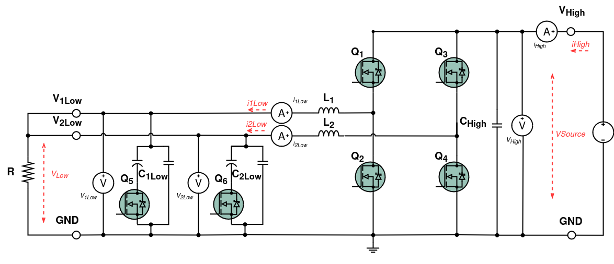
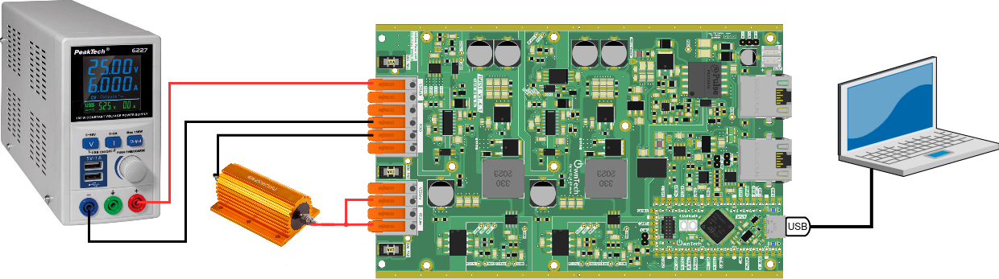
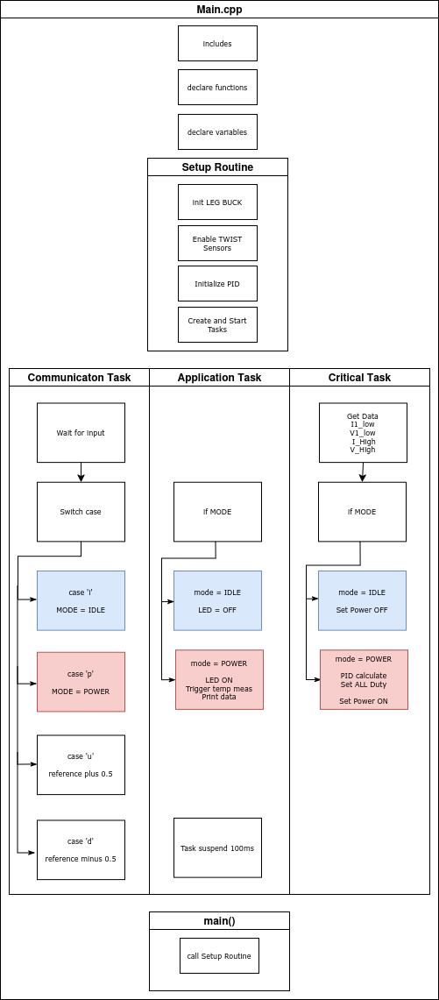
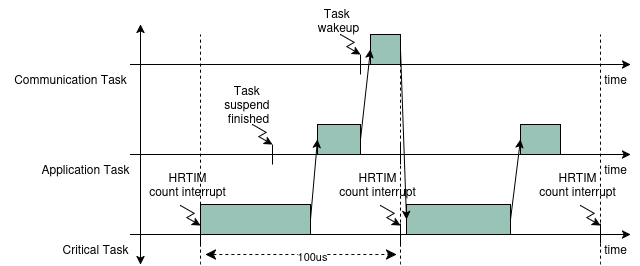
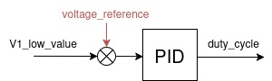
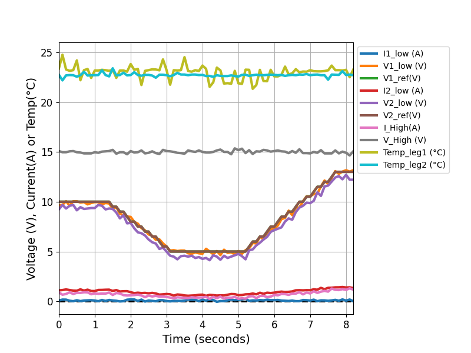

# Buck with PID controlled output voltage

A voltage mode buck converter regulates voltage by comparing the output voltage to a reference voltage. It adjusts the duty cycle of its switching signal to keep the output voltage stable. This type of converter efficiently steps down voltage levels, making it useful in various electronic devices like embedded battery charger.

This example will implement a voltage mode buck converter to control the output.

!!! attention Are you ready to start ?
    Before you can run this example, you must have successfully gone through our [getting started](https://docs.owntech.org/core/docs/environment_setup/).  

## Hardware setup and requirement


The circuit diagram of the board is shown in the image below.




The power flows from `VHigh` to `VLow`. The wiring diagram is shown in the figure below.




!!! warning Hardware pre-requisites 
    You will need :
    - 1 TWIST
    - A dc power supply (20-60V)
    - A resistor (or a dc electronic load)

#### Main code structure

The `main.cpp` structure is shown in the image below.



The code structure is as follows:
- On the top of the code some initialization functions take place.
- **Setup Routine** - calls functions that set the hardware and software
- **Communication Task** - Handles the keyboard communication and decides which `MODE` is activated
- **Application Task** - Handles the `MODE`, activates the LED and prints data on the serial port 
- **Critical Task** - Handles the `MODE`, sets power ON/OFF and tracks the `V1_low_value` variable with a `PID`

The tasks are executed following the diagram below. 





- **Communication Task** - Is awaken regularly to verify any keyboard activity
- **Application Task** - This task is woken once its suspend is finished 
- **Critical Task** - This task is driven by the HRTIM count interrupt, where it counts a number of HRTIM switching frequency periods. In this case 100us, or 20 periods of the TWIST board 200kHz switching frequency set by default.


#### Control scheme

The control library is imported in platformio.ini via the line :

```
lib_deps=
    control_lib = https://github.com/owntech-foundation/control_library.git
```

We can use this library to initialize a PID control with the function :

```cpp
pid.init(pid_params);
```

The control diagram of the `PID` is shown in the figure below.




## Expected result

This code will control `V1low` and `V2low` voltages so that they follow a `voltage_reference`, you can control this reference through platformio serial monitor. The image below shows you a snippet of the window and the button to press.


When opening it for the first time, the serial monitor will give you an initialization message regarding the parameters of the ADCs as shown below.  


!!! tip Commands keys
    - press `u` to increase the voltage
    - press `d` to decrease the voltage
    - press `h` to show the help menu

Here's sequence when the help menu is activated with `h`, the power mode is then activated with `p` and finally the Twist converter is put in idle with the `i`. 


!!! note The data that you see
    When you send `p` the Twist board will send you back a stream of data on the following format: 
    
    ```c 
    I1:V1:VREF:I2:V2:VREF:IH:VH:T1:T2:
    ```
    Where: 
    - `I1` is the current in `LEG1` of the `LOW` side
    - `V1` is the voltage in `LEG1` of the `LOW` side
    - `VREF` is the reference voltage set for `LEG1` and `LEG2`vof the `LOW` side
    - `I2` is the current in `LEG1` of the `LOW` side
    - `V2` is the voltage in `LEG2` of the `LOW` side
    - `VREF` is the reference voltage set for `LEG1` and `LEG2`vof the `LOW` side
    - `IH` is the current in `LEG2` of the `LOW` side
    - `VH` is the voltage on the `HIGH` side
    - `T1` is the temperature from the NTC thermistor in `LEG1` of the `LOW` side
    - `T2` is the temperature from the NTC thermistor in `LEG2` of the `LOW` side

    For instance when you retrieve this: 

    ```c 
    1.44:14.80:0.13:16.14:1.14:22.82:
    ```

    It means that `I1 = 1.46 A`, `V1 = 14.80 V` and so on. 

    If you plot your data with a python code, you will see something similar to this: 

    

