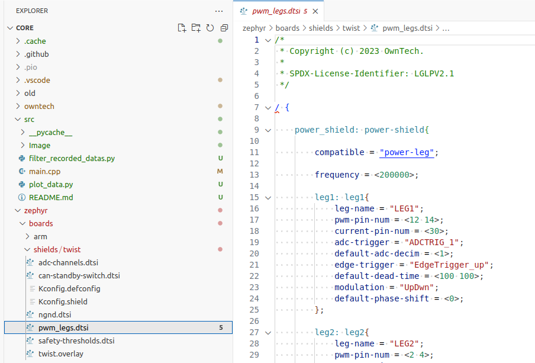
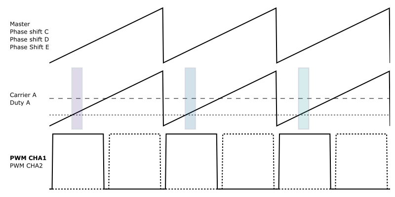
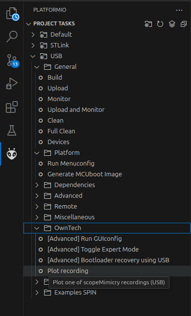
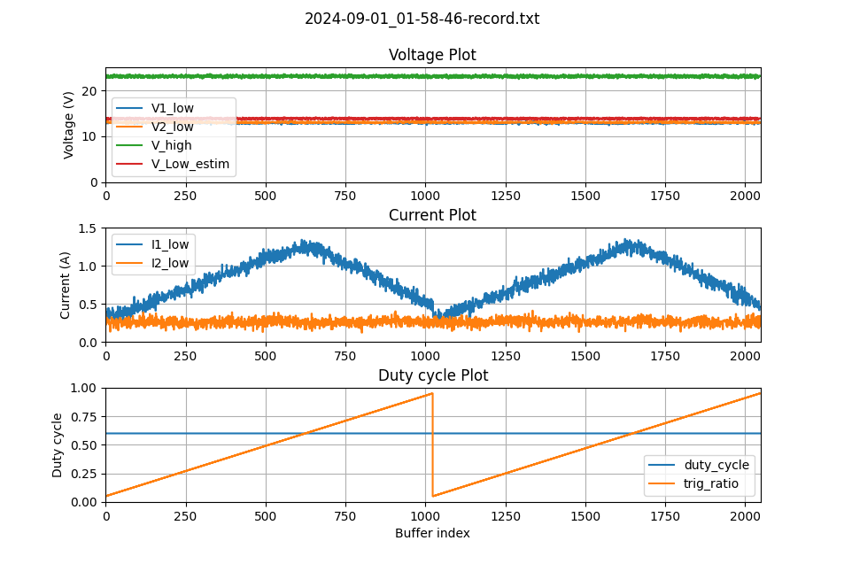

# Current ripple measurement.

Measuring current ripple can be useful to understand if the converter is operating correctly. However, it requires an oscilloscope and a special type of probe, making it difficult to achieve. 

In this example will use the embedded HAL sensor of the Twist board and multiply by 400 its resolution. To do so we will keep the converter in a stable operating condition and perform a measurement sweep. The procedure will be explained in more detail below.

We will call the function `shield.power.setTriggerValue(LEG1, trig_ratio);`,
where `trig_ratio` will be swept between 0 and 1.

We are in open loop and at a fixed duty cyle.

!!! warning 
    This is a very advanced example. Please take your time to execute it.


## Hardware setup and requirement


!!! warning Hardware pre-requisites 
    You will need :
    - 1 TWIST
    - A dc power supply (20-60V)
    - A resistor (or a dc electronic load)


## Update platformio.ini

To record the datas in a high rate (at the critical task routine sampling), we need to use RAM memory to store the datas. To help this management we have created a library: [ScopeMimicry](https://github.com/owntech-foundation/scopemimicry)

This library must be added by adding the following line in `platformio.ini`

```ini
lib_deps=
    scope = https://github.com/owntech-foundation/ScopeMimicry.git
```

In the example there's a function named: `dump_scope_datas()` which print
all the datas recorded in the console by pressing **`'r'`** in `IDLE_MODE`.

This data will be automatically processed and generate a `.txt`, a `.csv` and a `.png` file.

## Change Modulation type.
### Find the `twist_v1_4_1.overlay` file.
To see the file `zephyr/boards/shields/twist/twist_v1_4_1.overlay` in vscode, you must toggle in Expert Mode.


Then you should see the directory tree of `zephyr`. 



### Change the modulation type.

To rebuild the current waveform, we will use the `trig_ratio` variable to will peform a sweep on the moment the measurement is done in comparison with the carrier ramp. The image below illustrate how these changes are made for three different measurement instants. Notice the duty cycle is constant. 




!!! warning We have a problem 

    If we are in the `Center_Aligned` mode, the carrier is different as shown in the image below. 

    
    
    As you can see, there are two sides to the carrier, the rising edge or the falling edge. It is not possible to sweep from one to the other. 
    
    Thus it is necessary to change the modulation of the Twist board to `Lft_aligned`. 


In the `zephyr/boards/shields/twist/twist_v1_4_1.overlay`, change modulation as shown below:

```ts
        leg1: leg1{
            leg-name = "LEG1";
			pwms = <&pwma 1 0>, <&pwma 2 0>;
            pwm-pin-num = <12 14>;
            capa-pin-num = <7>;
            driver-pin-num = <19>;
            current-pin-num = <30>;
            default-adc-trigger = "ADCTRIG_1";
            default-adc-decim = <1>;
            default-edge-trigger = "EdgeTrigger_up";
            default-dead-time = <100 100>;
            // default-modulation = "UpDwn";
            default-modulation = "Lft_aligned";
            default-phase-shift = <0>;
			status = "okay";
        };

        leg2: leg2{
            leg-name = "LEG2";
			pwms = <&pwmc 1 0>, <&pwmc 2 0>;
            pwm-pin-num = <2 4>;
            capa-pin-num = <56>;
            driver-pin-num = <22>;
            current-pin-num = <25>;
            default-adc-trigger = "ADCTRIG_3";
            default-adc-decim = <1>;
            default-edge-trigger = "EdgeTrigger_up";
            default-dead-time = <100 100>;
            //default-modulation = "UpDwn";
            default-modulation = "Lft_aligned";
            default-phase-shift = <0>;
			status = "okay";
        };
```

## 3. Run the example.

!!! tip Finger in the trigger    

    To capture the current ripple you have to follow these steps:
    - press the **`p`** key to go in `POWER_MODE`
    - press the **`a`** key to activate the trigger of the `ScopeMimicry` instance.
    - press the **`i`** key to come back in `IDLE_MODE`
    - press the **`r`** key to retrieve the data.


After these steps you should see in your directory a new folder called `Data_records` appear.
Within it you will find three files with the following naming convention : 

- `Year-month-day-hour-minute-second.txt` - a raw data file
- `Year-month-day-hour-minute-second.csv` - a post-treated csv file
- `Year-month-day-hour-minute-second.png` - an automatically generated png file

As an example here are two acquisitions:


In the code there's some parameters you can change:
- `num_trig_ration_point`: it sets the number of trig_ratio value will be sweep
  between `begin_trig_ratio` and `end_trig_ratio`
- `begin_trig_ratio` : beginning value of the sweep.
- `end_trig_ratio`: end value of the sweep.

## 4. Plot the results.

Your `.png` file is used for a quick analysi of the results. For a better experience, you can plot the data using a platformio action. 

Follow these steps as in the image below: 
- Click on the alien
- Click on your environment (in this case `USB`)
- Click on the `owntech` folder
- Click on `Plot recording` 



This will prompt you in the terminal to choose your recording: 

```t
 *  Executing task: platformio run --target plot-record --environment USB 

Processing USB (board: spin; platform: ststm32@17.3.0; framework: zephyr)
-----------------------------------------------------------------------------------------------------------------------------------------------------------------------------------------------------------------------------------------------
Verbose mode can be enabled via `-v, --verbose` option
'zephyr,console = &lpuart1;' not found in './zephyr/boards/arm/spin/spin.dts'. No replacement performed.
record n°0, name 2024-09-01_01-50-00-record.txt
record n°1, name 2024-09-01_01-58-46-record.txt
Enter record number to plot
1
The record number is: 1
```
The result is shown in the image below.



There are three distinct plots: 
- **Voltage plot**: Showing the value of the voltage for `LEG1`, `LEG2`, `VHIGH` and a filtered value.
- **Current plot**: Showing the value of the current captured by the changes in the trigger ratio.
 - **Duty cycle plot**: Shows the values of the duty cycle and the trig ratio, both between 0 and 1.

!!! success  
    It is possible to see the ripple current in detail. This is the equivalent of two switching periods of the Twist board. From these values it is possible to calculate the ripple to be bewteen `0.4 A` and `1.4 A`, meaning `1.0 A` of ripple.
    
    This is a wave of `200kHz` with 1024 points of resolution. This is the equivalent of having a **400MHz sampling rate**! With a 1MHz current sensor.   