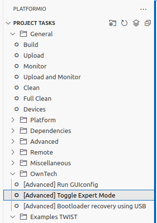
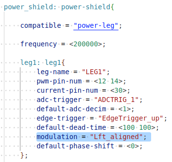

# Current ripple measurement.

In this example we use one leg of twist with no load.

We experiment the method `shield.power.setTriggerValue(LEG1, trig_ratio);`,
where `trig_ratio` is a variable between [0, 1]

We are in open loop and fix a duty cyle.


Before to run the example some things have to be done:

1. Update `platformio.ini`
2. Change Modulation type in `zephyr/boards/shields/twist/pwm_legs.dtsi`

## 1. Update platformio.ini

To record the datas in a high rate (at the critical task routine sampling), we need
to use RAM memory to store the datas. To help this management we have created a
a library: [ScopeMimicry](https://github.com/owntech-foundation/scopemimicry)

This library must be added by adding the following line in `platformio.ini`

```ini
lib_deps=
    scope = https://github.com/owntech-foundation/ScopeMimicry.git
```

In the example there's a function named: `dump_scope_datas()` which print
all the datas recorded in the console by pressing **`'r'`** in `IDLE_MODE`.

To catch these datas we have defined a python script named: `filter_recorded_datas.py`.

To use it you have to create a `monitor` directory and put this file in.

<figure>

<figcaption> Create the directory <em>monitor</em></figcaption>
</figure>

## 2. Change Modulation type.
### Find the `pwm_legs.dtsi` file.
To see the file `zephyr/boards/shields/twist/pwm_legs.dtsi` in vscode, you must toggle in Expert Mode.

<figure>
    
    <figcaption> toggle in "Expert Mode"</figcaption>
</figure>

Then you should see the directory tree of `zephyr`. 
<figure>
    
    <figcaption>find the pwm_legs.dtsi file.</figcaption>
</figure>

### Change the modulation type.
The `trig_ratio` value swipe the carrier ramp.
But if we are in the `Center_Aligned` mode, there's two ramp and the swipe is only on
one ramp, in `Lft_aligned` mode there's only one ramp then the swipe is on all the
switching period.

<figure>

<figcaption> Change the modulation field </figcaption>
</figure>

## 3. Run the example.

When you run the example, you have to follow these steps:

1. press the **'p'** key to go in `POWER_MODE`
2. press the **'a'** key to activate the trigger of the `ScopeMimicry` instance.
3. press the **'i'** key to come back in `IDLE_MODE`
4. press the **'r'** key to retrieve the datas.


After these steps you should see in your directory a new file appear
with the following naming convention : `<Year-month-day-hour-minute-second.txt>`


In the code there's some parameters you can change:

* `num_trig_ration_point`: <br> it sets the number of trig_ratio value will be swipe
  between `begin_trig_ratio` and `end_trig_ratio`
* `begin_trig_ratio` : <br>beginning value of the swipe.
* `end_trig_ratio`: <br>end value of the swipe.


## 4. Plot the results.

in your terminal, if in your python environment you have the modules: `matplotlib, numpy and pandas`
then you can plot the results by calling the following line:
```sh 
python monitor/plot_records.py <recoded_file.txt>
```

<figure>

<figcaption>Example of data recorded</figcaption>
</figure>
