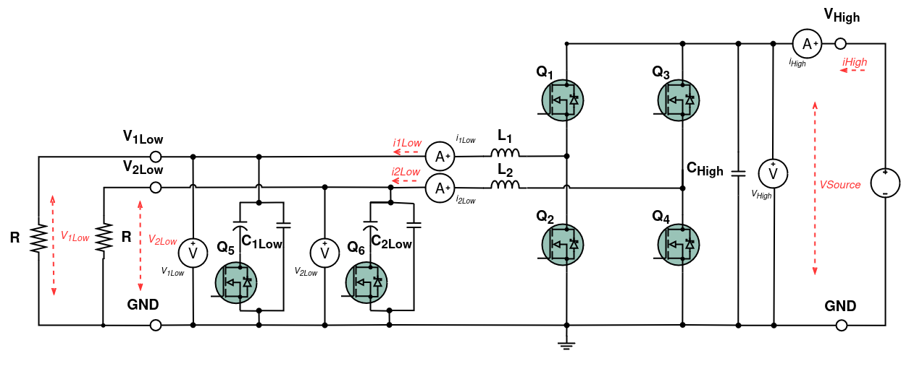
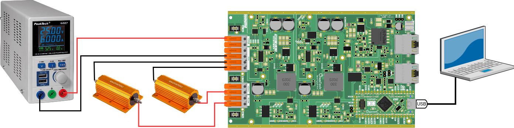
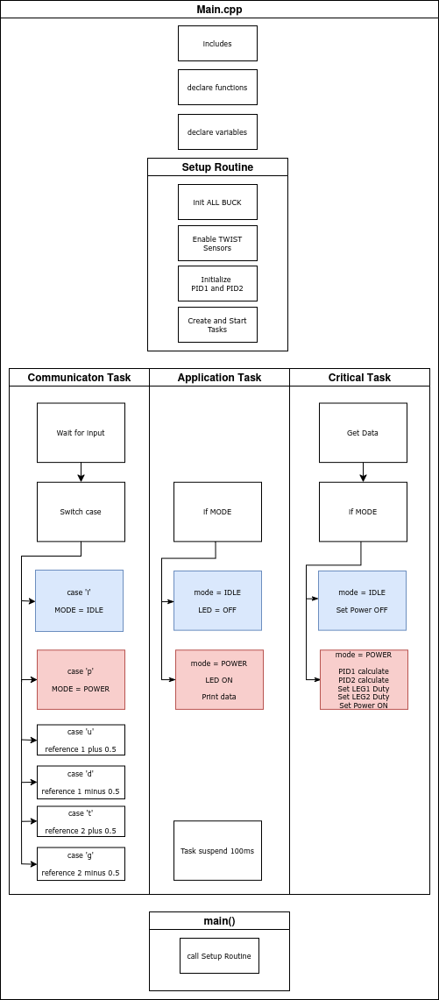
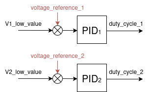
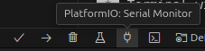
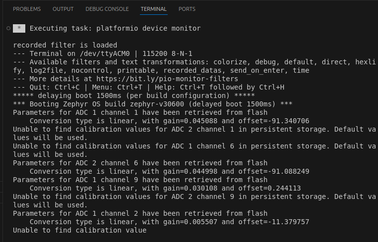
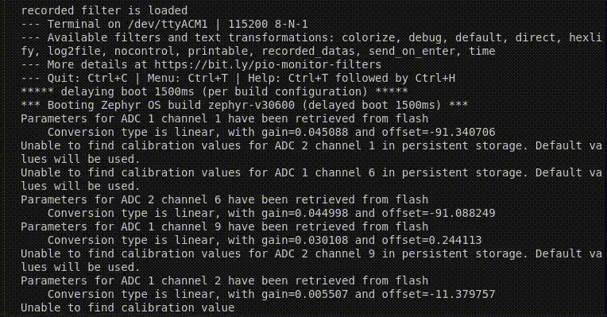
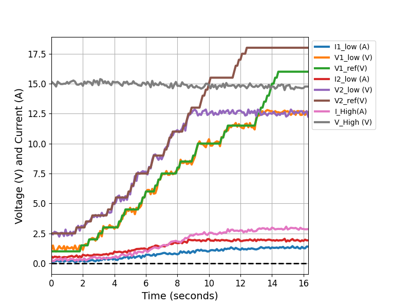

# Independent Leg operation

## Overview

The Twist board has two different legs, which allows it to generate two different voltage or current outputs. 


This example will implement two independent power outputs, each with its own voltage reference.

!!! warning "Are you ready to start?"
    Before you can run this example:
    - you **must** have successfully gone through our [getting started](https://docs.owntech.org/latest/core/docs/environment_setup/).
    - ideally, you should have successfully gone through our [Voltage Mode Example](https://docs.owntech.org/latest/examples/TWIST/DC_DC/buck_voltage_mode/)  


## Hardware setup and requirements

The circuit diagram of the example is shown in the image below.




The power flows from `VHigh` to both `VLow1` and `VLow2` independently. The wiring diagram is shown in the figure below. Notice each resistor is connected to a different leg.




!!! warning Hardware pre-requisites 
    You will need:
    - 1 TWIST
    - A DC power supply (20-60 V)
    - A resistor (or a DC electronic load)


## Main Structure

The `main.cpp` structure is shown in the image below.



The code structure is as follows:
- On the top of the code some initialization functions take place.
- **Setup Routine** - calls functions that set the hardware and software. Notice that it creates 2 distinct PID controllers. 

    ```cpp
    /* Initialize buck with current mode*/
    pid1.init(pid_params1);
    pid2.init(pid_params2);
    ```

- **Communication Task** - Handles the keyboard communication and decides which `MODE` is activated
- **Application Task** - Handles the `MODE`, activates the LED and prints data on the serial port 
- **Critical Task** - Handles the `MODE`, sets power ON/OFF, calls each `PID` to correct the voltage of each `LEG` independently as seen below. 
    ```cpp
    duty_cycle_1 = pid1.calculateWithReturn(voltage_reference_1, V1_low_value);
    duty_cycle_2 = pid2.calculateWithReturn(voltage_reference_2, V2_low_value);
    shield.power.setDutyCycle(LEG1,duty_cycle_1);
    shield.power.setDutyCycle(LEG2,duty_cycle_2);
    ```


The tasks are executed following the diagram below. 


- **Communication Task** - Is awakened regularly to verify any keyboard activity
- **Application Task** - This task is woken once its suspension is finished 
- **Critical Task** - This task is driven by the HRTIM count interrupt, where it counts a number of HRTIM switching frequency periods. In this case 100us, or 20 periods of the TWIST board 200kHz switching frequency set by default.


### Control diagram

The implementation of the independent mode follows the model below. Each leg has its own dedicated `PID` controller.


_Source : STM32 AN5497_

!!! note
    Each leg has its own dedicated `PID` controller.

## Expected result

This code will control the output voltage to have 15 V. You can control the output voltage with the PlatformIO serial monitor. The image below shows you a snippet of the window and the button to press.



When opening it for the first time, the serial monitor will give you an initialization message regarding the parameters of the ADCs as shown below.  



!!! tip Command keys
    - press `u` to increase the voltage on `LEG1`
    - press `d` to decrease the voltage on `LEG1`
    - press `t` to increase the voltage on `LEG2`
    - press `g` to decrease the voltage on `LEG2`
    - press `h` to show the help menu

Here's the sequence when the help menu is activated with `h`, the power mode is then activated with `p` and finally the Twist converter is put in idle with the `i`. 



!!! note The data that you see
    When you send `p` the Twist board will send you back a stream of data on the following format: 
    
    ```c 
    I1:V1:VREF1:I2:V2:VREF2:IH:VH
    ```
    Where: 
    - `I1` is the current in `LEG1` of the `LOW` side
    - `V1` is the voltage in `LEG1` of the `LOW` side
    - `VREF1` is the reference voltage set for `LEG1` of the `LOW` side
    - `I2` is the current in `LEG1` of the `LOW` side
    - `V2` is the voltage in `LEG2` of the `LOW` side
    - `VREF2` is the reference voltage set for `LEG2` of the `LOW` side
    - `IH` is the current in `LEG2` of the `LOW` side
    - `VH` is the voltage on the `HIGH` side

    For instance, when you receive this: 

    ```c 
    0.203:1.037:1.000:0.513:2.818:2.500:0.420:14.997643
    ```

    It means that `I1 = 0.203 A`, `V1 = 1.037 V` and so on. 

    If you plot your data with a Python code, you should get something like the image below. You can see each voltage follows its own reference, up until saturation.   

    


