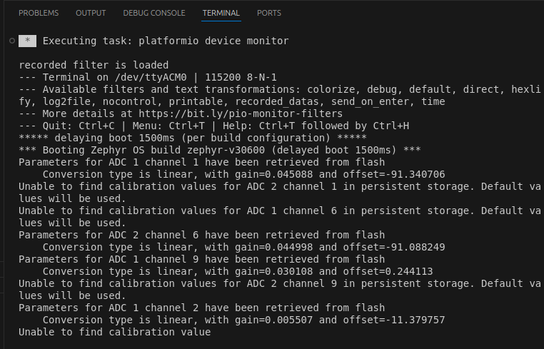

# Scope simple example

The scope is a powerful tool to inspect electric signals is real time. In this example we will visualize a simple step response of `LEG1` PID.

This example will implement a voltage mode buck converter to control the output.

!!! warning "Are you ready to start ?"
    Before you can run this example, you must have successfully gone through our [getting started](https://docs.owntech.org/latest/core/docs/environment_setup/).  

## Hardware setup and requirement


!!! warning Hardware pre-requisites 
    You will need :
    - 1 TWIST
    - A dc power supply (20-60V)
    - A resistor (or a dc electronic load)

## Software setup

The software should work out of the box. Build and upload it to the board.

The data to be saved to the scope is structured in the `setup_routine`.

```cpp
    scope.connectChannel(I1_low_value, "I1_low");
    scope.connectChannel(V1_low_value, "V1_low");
    scope.connectChannel(I2_low_value, "I2_low");
    scope.connectChannel(V2_low_value, "V2_low");
    scope.connectChannel(duty_cycle, "duty_cycle");
    scope.connectChannel(V_high, "V_high");
    scope.set_trigger(&a_trigger);
    scope.set_delay(0.2F);
    scope.start();

```
Where the voltages and currents of `LEG1` and `LEG2`, the `duty_cycle` and the `V_HIGH` are going to be saved. The delay to apply the trigger is of 20% of all the measurements. 

## Expected result

This code will control the output voltage to have 15V, you can control the output voltage with platformio serial monitor. The image below shows your a snippet of the window and the button to press.


When opening it for the first time, the serial monitor will give you an initialization message regarding the parameteres of the ADCs as shown below.  



!!! tip Commands keys
    - press `u` to increase the voltage
    - press `d` to decrease the voltage
    - press `a` to increase the voltage step to be applied
    - press `z` to decrease the voltage step to be applied
    - press `s` to apply the voltage step and automatically retrieve the data
    - press `r` to retrieve the data
    - press `h` to show the help menu


!!! note The data that you see
    When you send `p` the Twist board will send you back a stream of data on the following format: 
    
    ```c 
    I1:V1:I2:V2:IH:VH:VREF:VSTEP
    ```
    Where: 
    - `I1` is the current in `LEG1` of the `LOW` side
    - `V1` is the voltage in `LEG1` of the `LOW` side
    - `I2` is the current in `LEG1` of the `LOW` side
    - `V2` is the voltage in `LEG2` of the `LOW` side
    - `IH` is the current in `LEG2` of the `LOW` side
    - `VH` is the voltage on the `HIGH` side
    - `VREF` is the reference voltage set for `LEG1` and `LEG2`vof the `LOW` side which is applied during `POWER` mode.
    - `VSTEP` is the size of the voltage step to be applied for the test. 


