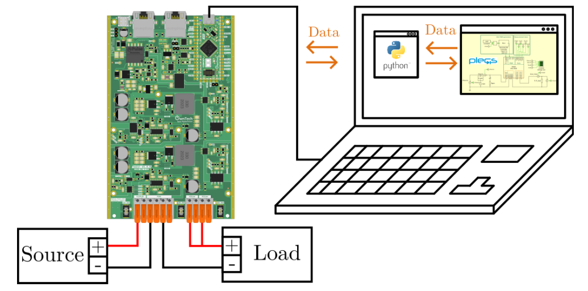
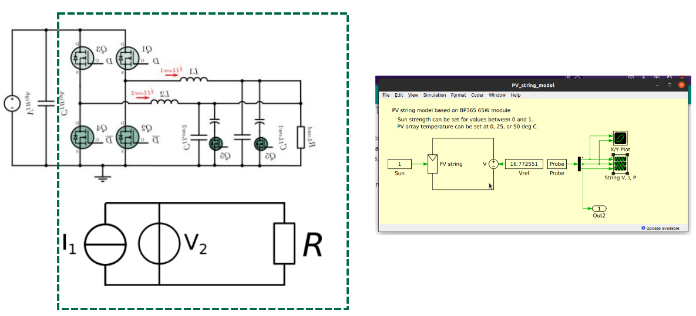
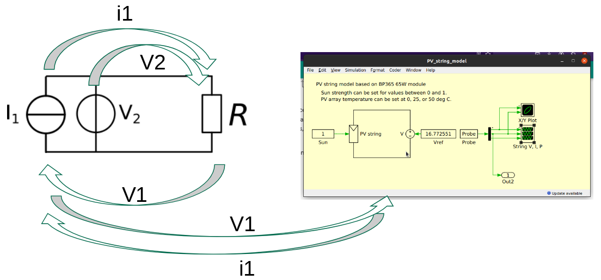

# PV Emulator

A PV emulator is a power converter that is controlled to behave as a PV system.
It drives the current in its output as a function of its voltage.

In this example, we emulate a PV module and its MPPT on a Twist 1.4.1 board using a plecs model and a resistor as a load.

!!! info `plecs` usage
    We use `plecs` here to illustrate the possiblity of interfacing the Twist board with a model and to create a digital Twin.
    This same example could be used with a simple look-up-table.

!!! danger Advanced example
     This is an advanced example. Make sure you are comfortable with using the [voltage mode](https://docs.owntech.org/examples/TWIST/DC_DC/buck_voltage_mode/) **before** doing this emulator.


## Hardware wiring and requirement

`LEG1` and `LEG2` are connected in parallel on the low side, as shown in the figure below.



You will need :
- 1 TWIST
- A dc power supply (20-60V)
- A resistor
- one pc

!!! warning Make sure you read this readme all the way to the end

## Embedded Firmware setup

We import `control_pid` and `communication_library` in `platformio.ini` via the line :

```ini
lib_deps=
    control_pid = https://gitlab.laas.fr/owntech/power-api/opalib-control-pid.git
    comm_protocol = https://github.com/owntech-foundation/python_twist_comm_protocol.git
```

## Embedded Firmware explanation


We can use this library to initialize a PID control with the function :

```cpp
opalib_control_init_leg1_pid(kp, ki, kd, control_task_period);
```

the initial parameters are defined using the following lines :

```cpp
#include "opalib_control_pid.h"
static uint32_t control_task_period = 100; //[us] period of the control task
/* PID coefficient for a 8.6ms step response*/
static float32_t kp = 0.000215;
static float32_t ki = 2.86;
static float32_t kd = 0.0;
```

The software deploys a communication system with three modes:

1. **IDLE**
   - application_task: stops broadcasting data
   - critical_task: stops the power flow

2. **POWER_OFF**
   - application_task: broadcasts system status data on the serial port
   - critical_task: stops the power flow

3. **POWER_ON**
   - application_task: broadcasts sensor data on the serial port together with other data
   - critical_task: starts the power flow, controls the power flow with a PID

!!! Tip How the system works
    Characters are sent via the Serial port to the `SPIN` board.
    It parses these characters and decides which value to put in which variables that describes the power converter.
    For more details, please checkout the [communication protocol library readme](https://github.com/owntech-foundation/python_twist_comm_protocol)


## Python script

The Python code handles communication, the MPPT and the interaction with the plecs model.

The power converter behavior can be represented by a voltage source in parallel with a current source.



In this example:
  - `LEG1` is driven as current source and emulates the PV.
  - `LEG2` is driven as a voltage source and emulates the MPPT.
  - The `plecs` model is used to calculate the current reference to be followed by `LEG1`.

The Hardware-in-the-loop algorithm is represented by the image below.



In order:
  - `LEG1` sends `I1` to the resistor.
  - `LEG2` sets `V2` and by consequences `VR` to a certain value.
  - `LEG1` measures `V1`.
  - `V1` is sent to the `plecs` model to trigger a simulation.
  - `I1` is sent to `LEG1`
  - The loop starts again.

## Hardware setup

This code was tested using the following hardware setup:


On the photo:
  - A computer running `plecs` and the `PV_MPPT_Script.py` script.
  - A Twist board connected in Buck mode.
  - A voltage source.
  - A resistor connected to `LEG1` and `LEG2`
  - `LEG1` and `LEG2` connected in parallel.

## How to use this example

Before running the code

!!! warning Make sure you have:
    - `plecs` installed in your computer. If you do not have `plecs` Follow our tutorial [here](https://docs.owntech.org/OwnModels/docs/getting_started/).
    - make sure all the `requirements` installed in your computer
    - that you follow the [firmware setup instructions](#embedded-firmware-setup) and have the appropriate libraries listed in `platformio.ini`.
    - flash the `main.cpp` in your Twist board

Once all of the above are ok, you can then run the `PV_MPPT_Script.py` script with your python3.
