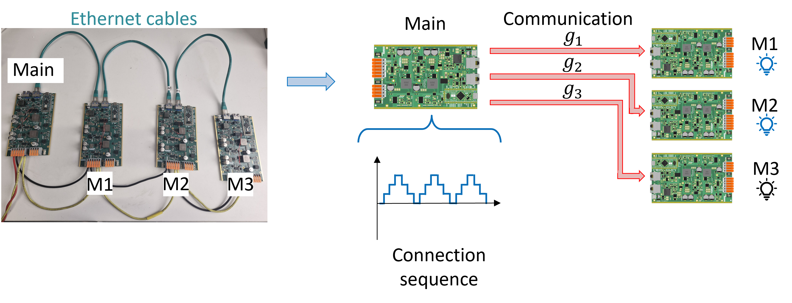
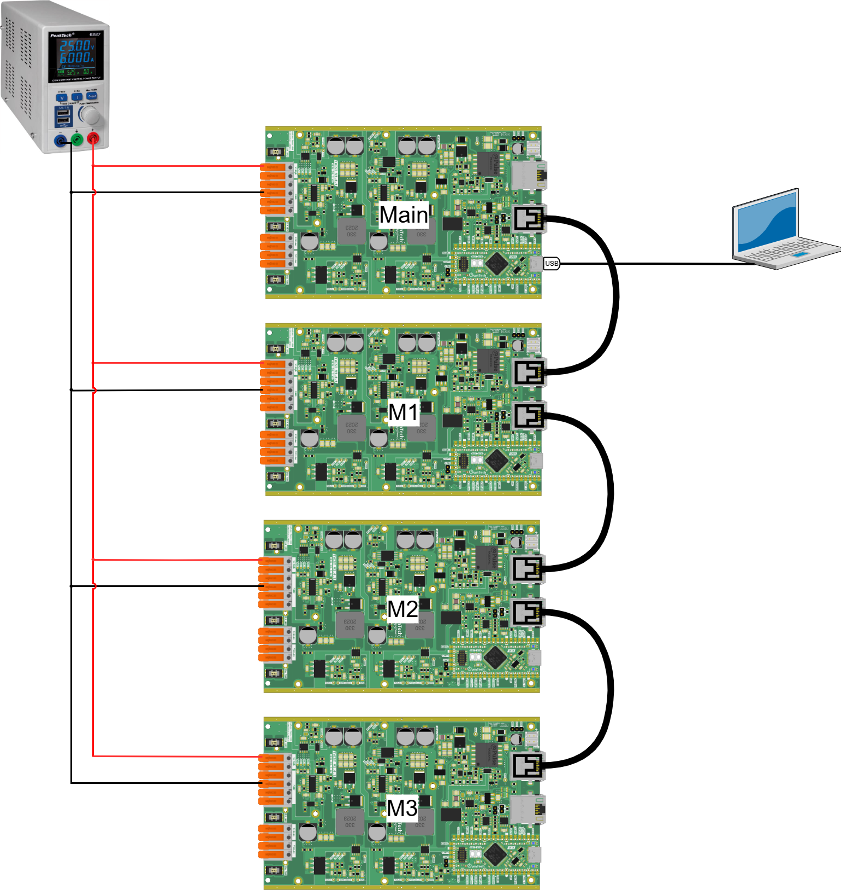
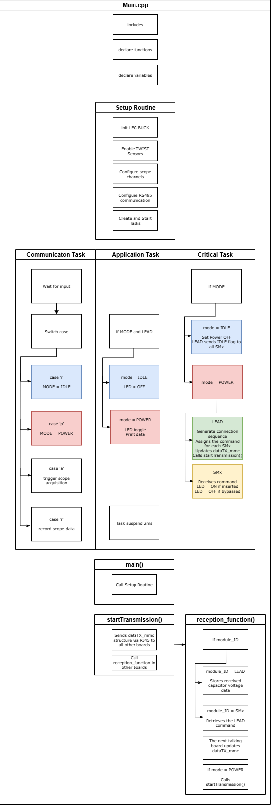
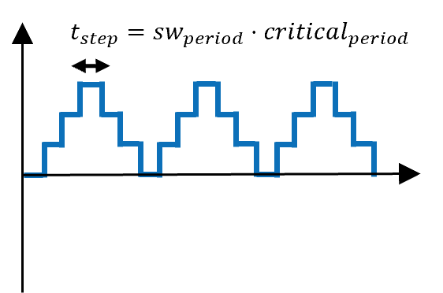
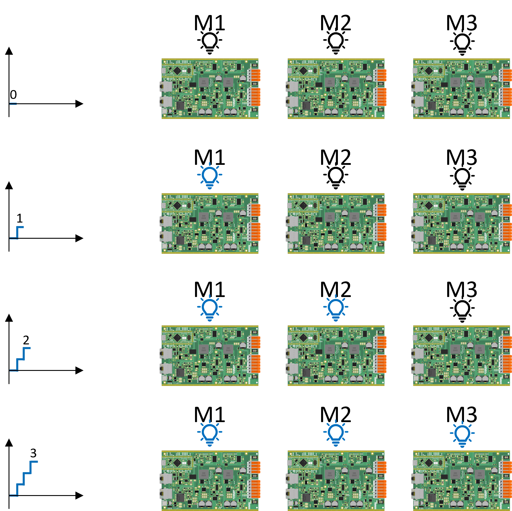

# Blinky MMC arm

TThe goal of this tutorial is to do a first MMC arm without using power with the following structure:



The main board serves as the central controller in the classical structure of the MMC. It will generate a connection sequence going from 0 to 3 that indicates how many modules should be connected. Then, it choses which modules to connect according to the preset preference order M1 → M2 → M3.

Then, the main board sends the connection commands g1, g2 and g3 via the Ethernet cables to the M1, M2 and M3 boards. If the board receives the command to be connected, it turns ON its SPIN board LED. If the board receives the command to be disconnected, it turns OFF its SPIN board LED.

!!! attention Are you ready to start ?
    Before you can run this example, you must have successfully gone through the [getting started](https://docs.owntech.org/core/docs/environment_setup/).  

## Hardware setup and requirement

The Hardware setup is shown in the figure below



!!! warning Hardware pre-requisites 
    You will need :
    - 4 TWIST
    - USB-C cable
    - DC Power Supply (48 V, 2 A)
    - 3 Ethernet cables (RJ45)
    - Cables to connect with the power supply
    - PC 64-bits (windows or linux)

#### Main code structure

The `main.cpp` structure is shown in the image below.



The code structure is as follows:
- On the top of the code some initialization functions and variables definition take place
- **Setup Routine** - Calls functions that set the hardware and software, and configures the RS485 communication
- **Communication Task** - Handles the keyboard communication with the #LEAD and decides which `MODE` is activated
- **Application Task** - Activates the #LEAD LED and prints data on the serial port according to the `MODE`
- **Critical Task** - Handles the control according to the `MODE`, effectively implements the connection sequence and data transmission from #LEAD to all #SMx

After the #LEAD starts the transmission, the reception_function is used in the receiver to store the information and continue the transmission sequence to the next board.

The tasks are executed following the diagram below. 


- **Communication Task** - Is awaken regularly to verify any keyboard activity
- **Application Task** - This task is woken once its suspend is finished 
- **Critical Task** - This task is driven by the HRTIM count interrupt, where it counts a number of HRTIM switching frequency periods. In this case 100us, or 20 periods of the TWIST board 200kHz switching frequency set by default.

#### Connection sequence

The connection sequence has a specific frequency set by the variable sw_period and the critical task period.



The value of the connection sequence signal corresponds to the number of modules to insert. Then, using the preset connection order, we have:



#### Communication structure

In the critical task, when POWER mode is activated, data transmission is first started sending the data structure dataTX_mmc from #LEAD to all #SMx.

The data structure sent is defined as:
```
dataTX_mmc or dataRX_mmc
└─ command
└─ capacitor_voltage
└─ status
└─ ID
```
In which:
- command = command to be inserted (1) or bypassed (0) sent to the module
- capacitor_voltage = stores the measured capacitor voltage on the #SMx
- status = flag corresponding to POWER (1) or IDLE (0) mode
- ID = identification of the board as #LEAD or #SMx

After the #LEAD starts the transmission, the reception_function is used in the receiver to store the information and continue the transmission sequence to the next board with sequence LEAD → M3 → M2 → M1

## Expected result

First Build and Upload the code into the 4 boards changing the variable module_ID to MMC_LEAD, MMC_SM1, MMC_SM2 or MMC_SM3 according to the board function.

You can control the mode through platformio serial monitor. The image below shows you a snippet of the window and the button to press.


Follow this step-by-step to perform the tutorial:
1.	Press h to display the help menu.
2.	The main and M1, M2 and M3 boards starts in IDLE mode.
3.	Turn on the power supply around 15 V to power the 4 SPIN boards.
4.	Press p to switch to POWER mode and the modules LEDs will start to light up and off according to the connection sequence.
5.	Press i to switch to IDLE mode and stop the arm operation.
6.	Turn off the power supply.
7.  Return to step 3 to escute it again

You expect to see the stair-wave connection sequence changing the modules LEDs going from 0 to 3 and to 0 again.