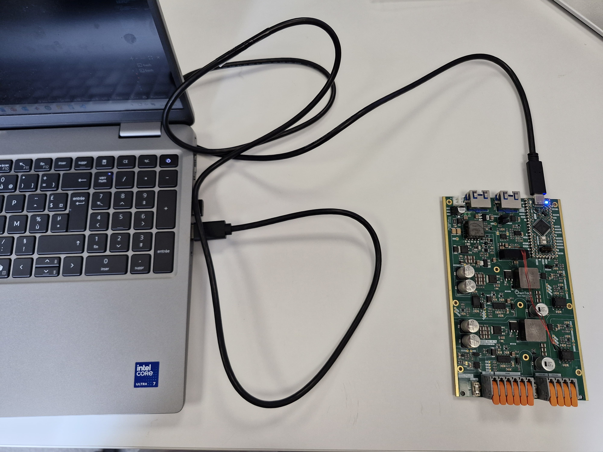
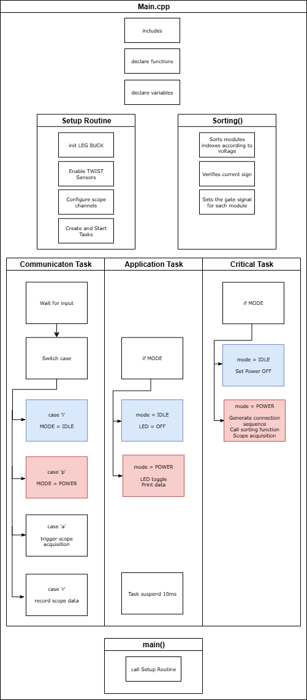
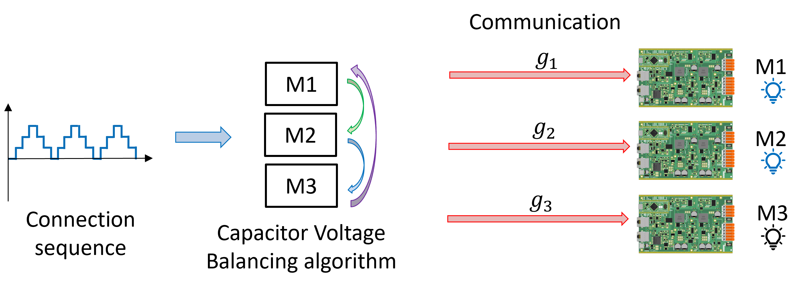
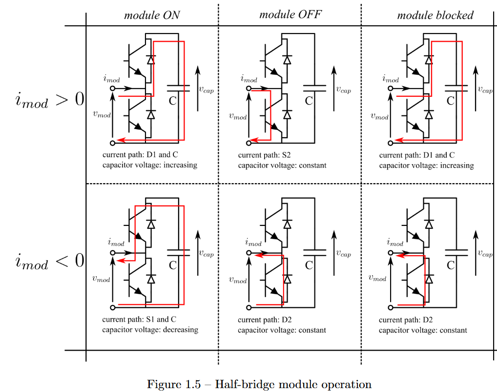
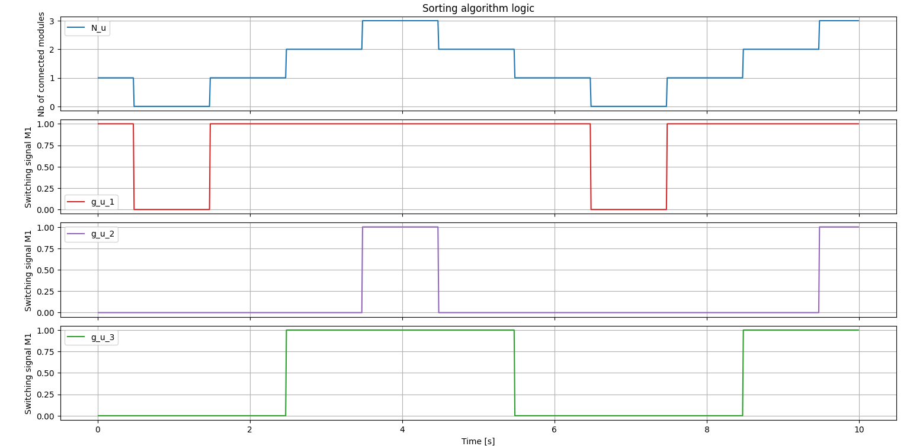

# MMC Firmware and Sorting algorithm

The goal of this tutorial is test the logic of the Capacitor Voltage Balancing (CVB) algorithm, that is one of the control blocks of the MMC, and the gate signal assignement.
- The CVB algorithm is used in the MMC in order to create a preference order for the connection of modules into the arm according to the capacitor voltages and the charge/discharge of the modules capacitors.
- With the preference order defined, the gate signal assignement is done defining which modules to insert (1) or bypassed (0) to the arm.

This example will only implement the control logic in a LEAD board working as the central controller.

!!! attention Are you ready to start ?
    Before you can run this example, you must have successfully gone through the [getting started](https://docs.owntech.org/core/docs/environment_setup/).  

## Hardware setup and requirement

The Hardware setup is shown in the figure below

!!! warning Hardware pre-requisites 
    You will need :
    - 1 TWIST
    - USB-C cable

#### Main code structure

The `main.cpp` structure is shown in the image below.

The code structure is as follows:
- On the top of the code some initialization functions and variables definition take place
- **Setup Routine** - Calls functions that set the hardware and software
- **Communication Task** - Handles the keyboard communication and decides which `MODE` is activated
- **Application Task** - Activates the LED and prints data on the serial port according to the `MODE`
- **Critical Task** - Handles the control according to the `MODE`, effectively implements the CVB algorithm and gate assignement

The tasks are executed following the diagram below. 

- **Communication Task** - Is awaken regularly to verify any keyboard activity
- **Application Task** - This task is woken once its suspend is finished 
- **Critical Task** - This task is driven by the HRTIM count interrupt, where it counts a number of HRTIM switching frequency periods. In this case 100us, or 20 periods of the TWIST board 200kHz switching frequency set by default.

#### CVB and gate assignement logic

The CVB algorithm is used in the MMC control in order to create a preference order for the insertion of modules into the arm, as shown in the image below.

This algorithm is extremely important since the module main element, the capacitor charges and discharges according to the current as seen in the image below for a half-bridge module (HB).

Therefore, if the connection order is random, the voltage of the modules in one arm are going to have different values every time, which is not good for the converter operation. So, we use the CVB algorithm to sort the modules according to is capacitor voltages with the objective of maintaining all modules within one arm in the same mean voltage level.

After the CVB sorting and the gate signal assignement within the algorithm works as follows:
- The algorithm receives the number of modules to be connected N from the modulation block.
- It verifies if this number is different from 0.
- If the arm current i_arm is positive, the capacitors are going to be charged. Then, the modules with smaller voltage are connected such that their voltage will increase.
- If the arm current i_arm is negative, the capacitors are going to be discharged. Then, the modules with higher voltage are connected such that their voltage will decrease.

To do this, we first sort the modules according to their capacitor voltages and then generate the switching signals indicating if they are connected or not.

## Expected result

First Build and Upload the code into the board.

You can control the mode through platformio serial monitor. The image below shows you a snippet of the window and the button to press.

Follow this step-by-step to perform the tutorial:
1.	Press h to display the help menu.
2.	The board starts in IDLE mode.
3.	Press p to switch to POWER mode and the CVB starts to choose the connected modules according to the connection sequence.
4.	Press a to set the start of acquired data.
5.	Press r when you think you have sufficient data to record.
6.	Press i to switch to IDLE mode and stop the CVB operation.
7.	Data will be recorded in src>>Data_records folder.
8.  Return to step 3 to escute it again

By plotting the recorded data, you expect to see the stair-wave connection sequence and the different gate signals.

To have this kind of plot, you can use the python code plot_CVB in src>>Data_records folder.

You can first verify if the algorithm logic is correct. Latter, you can play with the scope and connection sequence steps frequency or try to modify the number of modules, current signal and capacitor voltages to fully understand the code.