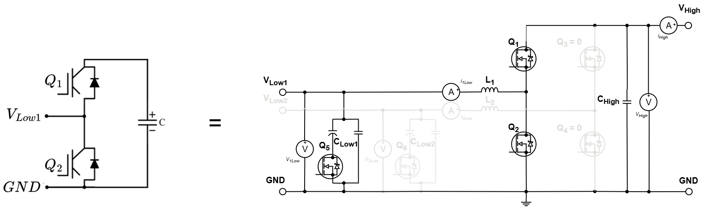
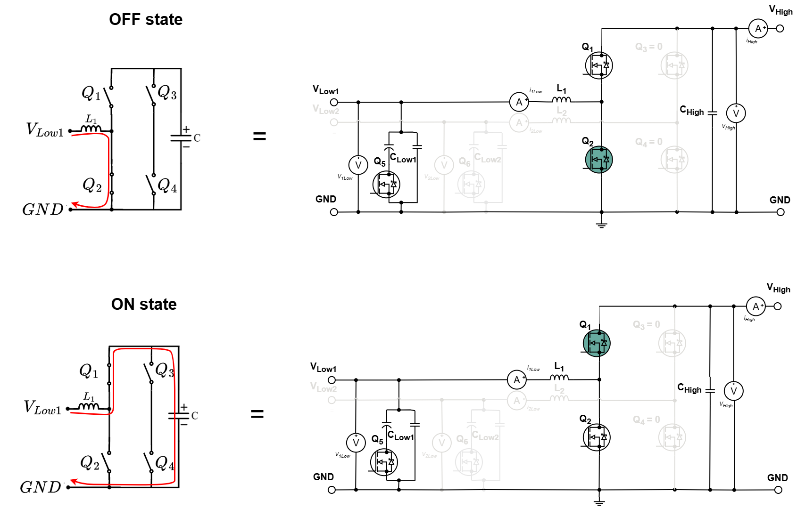
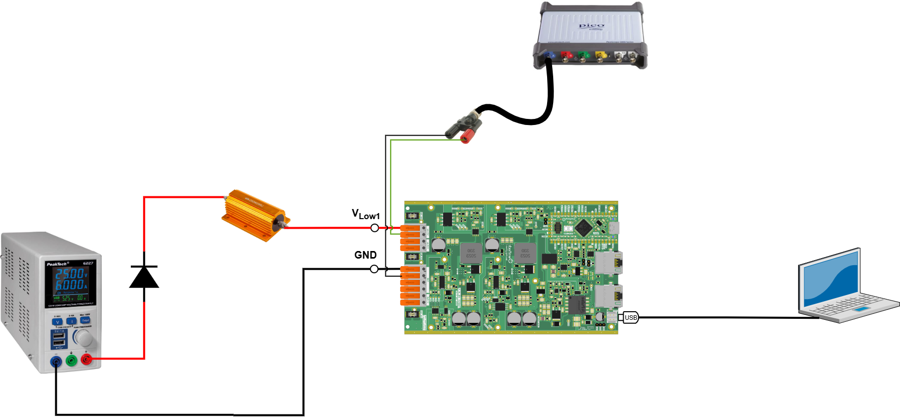
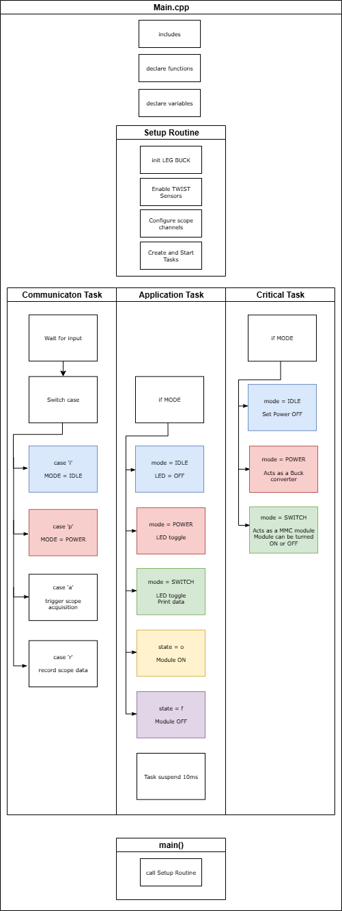
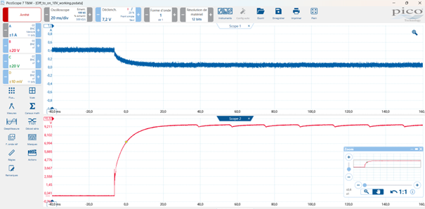

# MMC Single Module Test

The goal of this tutorial is to test a individual MMC module operation by programming its gate signal assignement according to a HB module.

The board serves as a HB module of the MMC by programming its second leg (LEG2) to be deactivated, having the following circuit:

Observe that the HIGH terminals are open (Vhigh to GND). The first leg (LEG1) switches are commanded to obtain the states connected (ON) or bypassed (OFF).

- ON state: the module is considered to be connected to the circuit and the current pass through its capacitor. In this state the module contributes to the arm voltage.
- OFF state: the module is considered to be bypassed from the circuit and the current does not pass through its capacitor. In this state the module does not contributes to the arm voltage.

This example will implement the control logic to achieve these states and test the module in power.

!!! attention Are you ready to start ?
    Before you can run this example, you must have successfully gone through the [getting started](https://docs.owntech.org/core/docs/environment_setup/).  

## Hardware setup and requirement

The Hardware setup is shown in the figure below

!!! warning Hardware pre-requisites 
    You will need :
    - 1 TWIST
    - USB-C cable
    - DC Power Supply (48 V, 2 A)
    - Oscilloscope
    - Cables to connect with the power supply
    - PC 64-bits (windows or linux)

#### Main code structure

The `main.cpp` structure is shown in the image below.

The code structure is as follows:
- On the top of the code some initialization functions and variables definition take place
- **Setup Routine** - Calls functions that set the hardware and software
- **Communication Task** - Handles the keyboard communication, decides which `MODE` is activated and the module state
- **Application Task** - Activates the LED and prints data on the serial port according to the `MODE`
- **Critical Task** - Handles the control according to the `MODE`, effectively implements the state assignment.

The tasks are executed following the diagram below. 

- **Communication Task** - Is awaken regularly to verify any keyboard activity
- **Application Task** - This task is woken once its suspend is finished 
- **Critical Task** - This task is driven by the HRTIM count interrupt, where it counts a number of HRTIM switching frequency periods. In this case 100us, or 20 periods of the TWIST board 200kHz switching frequency set by default.

#### State assignement

The module states are assigned using the PWM duty cycle. As LEG1 is programmed in Buck mode, the PWM is referenced to the HIGH switch (Q1) and the LOW switch (Q2) will have complementary state. Then:
- When setting duty cycle = 1, we set that Q1 is closed. Consequently, Q2 is open. This is the combination for ON state (module connected).
- When setting duty cycle = 0, we set that Q1 is open. Conseauenctly, Q2 is closed. This is the combination for OFF state (module bypassed).

## Expected result

First Build and Upload the code into the board.

You can control the mode and states through platformio serial monitor but it is preferable to use OwnPlot. You can learn how to use OwnPlot in the Basic tutorial in https://github.com/analuhaas/tutorial-TWIST-SPIN/blob/main/Tutorial_Twist_Board_JULIEN_HAAS_20250526.docx

Follow this step-by-step to perform the tutorial:
1.	The board starts in IDLE mode (board disactivated).
2.	Turn on the power supply around 10 V to power the circuit.
3.	Press the button “SWITCH mode” and the module will start already in ON module.
4.	Press the button “Module OFF” to put the module in OFF state.
5.	Press the button “Module ON” to put the module in ON state to see the transition.
6.	Press the button “Module OFF” to put the module in OFF state.
7.  Turn off the power supply.
8.	Press the button "IDLE mode" and stop the arm operation.
9.  Return to step 2 to execute it again.

If you acquire the transition in the oscilloscope using the trigger, you should expect a result like this:

In my case, Scope 1 measures the current entering the resistor and Scope 2 measures the voltage between the board terminals Vlow1 and GND, that are the modules terminals. This means that Scope 2 measures the output voltage of the half-bridge module.

The module starts at OFF and, at this moment, the module is bypassed having its voltage V_SM=0 V. Therefore, all the power supply voltage is in the resistor and a current of I≈0,4 A circulates into the circuit.
Then, the module transitions from OFF to ON state and the module capacitor C_high starts to charge until it achieves a voltage of V_SM=9,3 V.