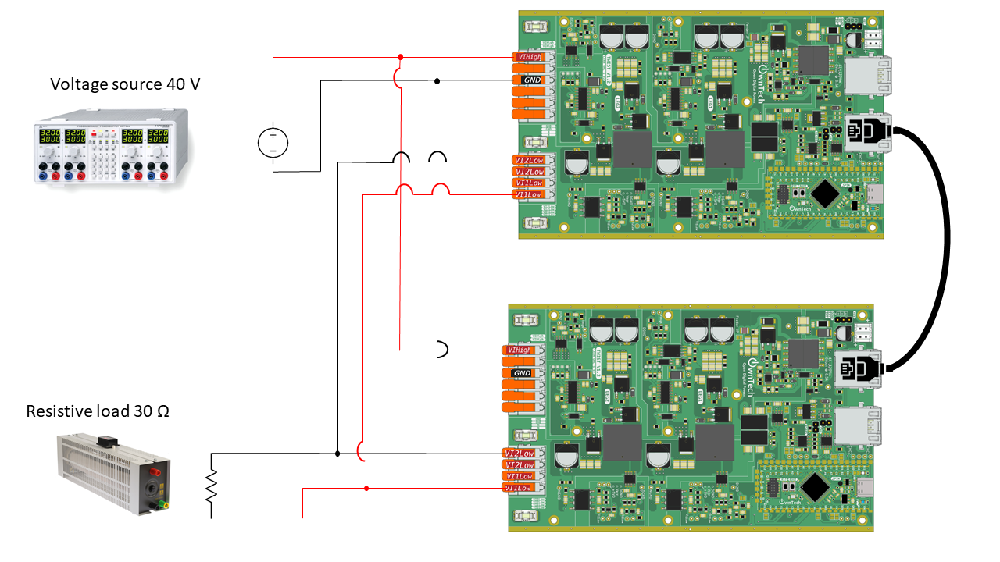

# Client/Server control AC/DC

## Overview

In a dual inverter setup with one inverter designated as the "SERVER" and the other as the "CLIENT," the SERVER inverter is responsible for sending a current reference and frequency signal to the CLIENT inverter. The CLIENT inverter, in turn, has the task of tracking the current reference from the SERVER and generating an output current that is in phase with the SERVER.

<div style="text-align:center"></div>

SERVER Inverter Operation:

The SERVER inverter is considered the primary control unit in the system. The SERVER inverter sets the output voltage, then it generates a reference signal for both the desired current magnitude (amplitude) and frequency to send to the CLIENT.

CLIENT Inverter Operation:

The CLIENT inverter receives the current reference and frequency signals from the SERVER. It compares the received current reference with the actual output current it is producing. The CLIENT inverter then adjusts its output voltage and frequency to match the reference signal provided by the SERVER. The goal is to ensure that the current generated by the CLIENT is in sync (in phase) with the current produced by the SERVER.

## Requirements and schematic



You will need:

- Two TWIST boards
- A **40V** DC power supply
- A **30Ω** resistive load
- An RJ45 cable

## Instructions to flash the code, and use the Python script

This example depends on two libraries:

1. control_library
2. ScopeMimicry

To use them, you have to add the following lines in the `platformio.ini` file:
```
lib_deps=
    control_library = https://github.com/owntech-foundation/control_library.git
    scope = https://github.com/owntech-foundation/scopemimicry.git 
```

In `src/main.cpp` at line 48 you have a macro that defines whether you are flashing the server or the client.

To flash the server, choose :

```c
#define server
```

To flash the client, choose :

```c
#define client
```

After that, connect to the inverter serial monitor and press `p` to start power flow. Press `i` to stop.

There is also a current gain to control the current reference sent to the CLIENT :

```c
tx_data.consigne.Iref_fromSERVER = k_gain*I1_low_value;
```

This allows you to increase or decrease the current of the CLIENT. To increase the current gain, in the serial monitor press `l`; to decrease it press `m`.

### To view some variables
After stopping, i.e. in IDLE mode, you can retrieve some data by pressing `r`. It calls a
function `dump_scope_datas()` which sends to the console variables recorded during
the power flow phase.

But before running, you have to add one line in the file `platformio.ini`

```ini
monitor_filters = recorded_datas
```

And you have to put the Python script `filter_datas_recorded.py` in a `monitor` directory
which must be in your parent project directory. Then the script should capture the
console stream to put it in a TXT file named `year-month-day_hour_minutes_seconds_record.txt`.

These files can be plotted using the `plot_data.py` Python script if you have the
`matplotlib` and `numpy` modules installed.

## Expected result

If you set up the project correctly, you should have server and client output current in phase together.


