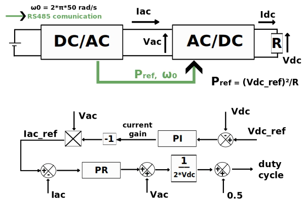
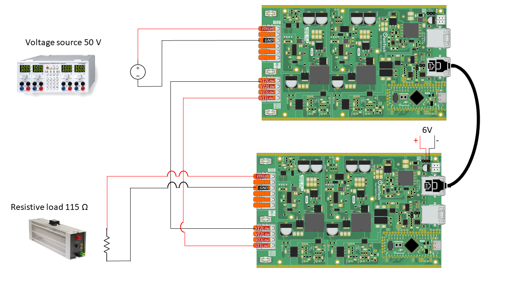

# Peer to peer AC control with an inverter and a synchronous rectifier
## Overview

Peer-to-peer communication in power electronics involves two converters, a DC/AC converter producing a certain power and informing an AC/DC converter that it can consume this reference power.





`GENERATOR` DC/AC Converter (**single phase inverter**): This converter is responsible for converting direct current (DC) power into alternating current (AC) power. It may be connected to renewable energy sources (such as solar panels or wind turbines) or batteries, which produce DC power. The DC/AC converter's task is to generate AC power for use in the electrical network.

`CONSUMER` AC/DC Converter (**single phase synchronous rectifier**): This converter performs the opposite function. It converts AC power back into DC power. This conversion is necessary when the electrical network requires DC power for various applications, such as charging batteries or powering DC devices.

In a peer-to-peer communication system, these converters communicate with each other to optimize power exchange. The DC/AC converter informs the AC/DC converter of the available power it can deliver. This information includes details like the power's magnitude and frequency.

An important aspect of this exchange is that the DC/AC converter must maintain an alternating current in phase opposition (180 degrees phase shift) with the input alternating voltage. This phase opposition ensures that power is effectively delivered to the load.

A **proportional resonant** is used to keep the input alternative current in phase opposition with the Vac, a PI is used to control the output voltage Vdc.

## Requirements and schematic




You will need:

- Two TWIST boards
- A **50V** DC power supply (input voltage for the inverter)
- A **6 V** DC power supply (external sensors/drivers supply for the synchronous rectifier)
- A **115Ω** resistive load
- An RJ45 cable

It is important to check that the boards you are using have the correct voltage and current measures since they'll be used to compute the duty cycle.

## Instructions to flash the code, and view some results


### To flash the code

This example depends on two libraries:

1. control_library
2. ScopeMimicry

To use them, you have to add the following lines in the `platformio.ini` file:
```
lib_deps=
    control_library = https://github.com/owntech-foundation/control_library.git
    scope = https://github.com/owntech-foundation/scopemimicry.git 
```

In `src/main.cpp` at line 48 you have a macro that defines whether you are flashing the inverter or the synchronous rectifier.

To flash the inverter, choose :

```shell
#define GENERATOR
```

To flash the synchronous rectifier, choose :

```shell
#define CONSUMER
```

Here P_ref = 20 W to have a 14 V output DC voltage. You can change this value on line 87 of the `src/main.cpp` file.

After that, connect to the inverter serial monitor and press `p` to start power flow. Press `i` to stop.

### To view some variables
While running, press `t` to trigger the scope.
After stopping, i.e. in IDLE mode, you can retrieve some data by pressing `r`. 


## Expected results

If everything goes well, you'll have 47 V delivered to the resistor.

Here are some results for Vdc and Idc :


And for Vac and Iac :


By using the Python script you can also watch MCU internal variables:


