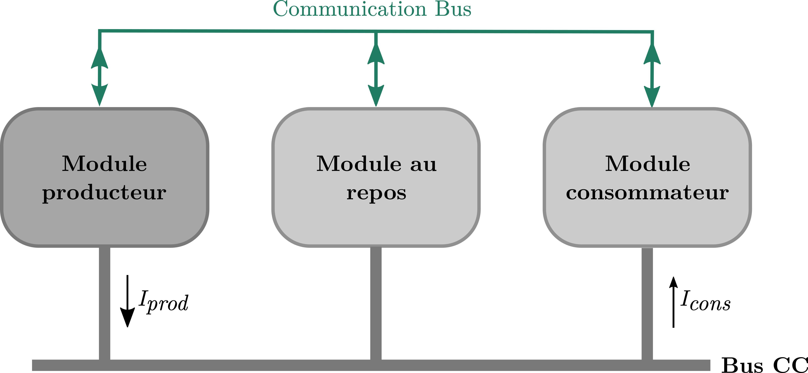

Title: RS485 Communication Experiment - Code Example

## Overview

This code example illustrates an experiment involving two power converters connected to a DC bus along with a variable load. The boards communicate using RS485, exchanging 8-bytes messages. The communication protocol utilizes three of the 8 bytes: one for card identification, another for start/stop commands, and the third for reference current value.

The first card operates to ensure its output current stays below 1 A. When bus current surpasses this threshold due to load increase, the generating card signals the idle card to activate. The idle card then assists in drawing some bus current, preventing the generating card from exceeding 1 A. If the bus current drops significantly, the idle card deactivates, allowing the generating card to respond to network current demand independently.

## Experimental Setup

- Two boards are used: a **master** board and one or more **slave** boards.
- The master board operates in voltage control mode and sends current references to slave boards.
- Slave boards operate in current control mode and respond to commands from the master board.
- RS485 communication protocol is used for data exchange.
- A control task period of 100µs is set for data exchange, at a speed of 20Mbs.

Below is the connexion diagram : 

| Connexion diagram | microgrid structure |
| ------ | ------ |
|        |  |


Hence the setup permits to deploy a simple microgrid with the following structure


## Communication Modules

### RS485 Communication

RS485 communication is established between the master and slave boards. The protocol uses 8-bytes messages, with 3 bytes allocated for card identification, start/stop commands, and reference current values. This example is based on RS485 example [test_com_master](https://gitlab.laas.fr/afarahhass/Test-Controle/-/blob/test_com_master/README.md?ref_type=heads)

## Code Usage

1. Upload `src/main.cpp` to the master board and each slave board.
2. In the `main.cpp` file, navigate to line 136 to find the macro definition:

   ```cpp
   #define MASTER
   ```

   Replace this macro with one of the following options based on the board you are flashing:

   For a slave board:
   ```cpp
   #define SLAVE
   ```
   
   or
   
   ```cpp
   #define SLAVE2
   ```

## Functions and Workflow

1. **Transmission and Verification:**
   - The control task period is set to 100µs, with master and slave exchanging 8-bytes data at a speed of 20Mbs.
   - The master initiates data transmission at the end of the control task.
   - Slave boards receive and send back data to the master.
   - The master responds to the slave's data by sending back a reply.
   - This process checks for data corruption between master and slave.

2. **Data Transmission:**
   - Enable USART by being in `POWERMODE` and pressing the letter 'p' via the serial monitor.
   - To start data transmission, use `serial_tx_on()`. Modify the `tx_usart_val` buffer to send specific data like voltage or current.

## Precautions

- Set the master board in `POWERMODE` before setting the slave board in the same mode.
- Ensure data transmission occurs between control tasks to manage CPU load.
- Only the master board should send data via the control task, and only once.

## Conclusion

This code example demonstrates an RS485 communication experiment between a master and slave boards. By following the instructions, uploading the code, and managing data transmission, you can simulate and observe the dynamic current control mechanism between the generating and idle cards, ensuring that the bus current stays within the desired limits.
