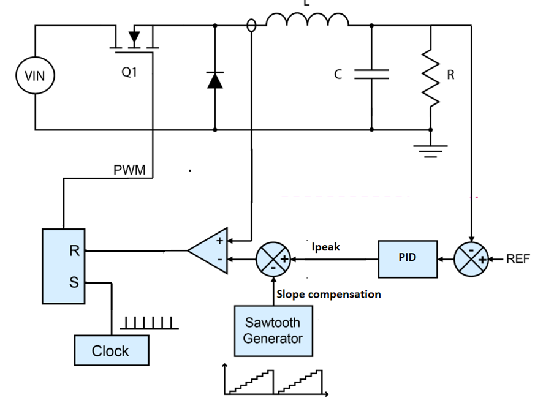
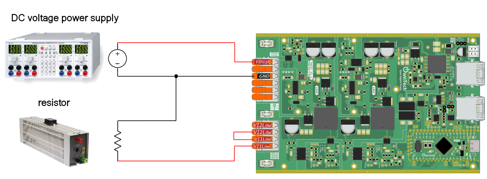

# Buck voltage mode

## Overview

A buck converter is a type of DC-DC converter used to efficiently regulate voltage levels. It works by converting a higher input voltage to a lower output voltage.

Peak current control mode is a technique used in DC-DC converters to regulate the output voltage. In this mode, the converter controls the output voltage by monitoring the peak current flowing through the inductor. When the peak current reaches a set limit, the converter switches off. This mode helps maintain stable output voltage by adjusting the duty cycle of the switching signal based on the peak current level, ensuring efficient and reliable power conversion.

Currently only **buck configuration** is supported for current mode.

### Control diagram

The general implementation of the current mode follow this model.


_Source : STM32 AN5497_

check [stm32 application note](https://www.st.com/resource/en/application_note/an5497-buck-current-mode-with-the-bg474edpow1-discovery-kit-stmicroelectronics.pdf) for more informations about current mode.


### Requirement and schematic



You will need :

- 1 twist
- A DC power supply
- A resistor (or a DC electronic load)

## Code overview

```cpp
 /* Initialize buck with current mode*/
    twist.initAllBuck(CURRENT_MODE);
```

The function PID_CM initialize a PID to control the output voltage. The voltage reference `Vref` is initially 15V but you can increase it or decrease it from the serial monitor with `u` and `d`.

```cpp
float32_t PID_CM(float reference, float measurement)
{
    /////
    // Compute error

    float32_t error = reference - measurement;

    /////
    // Compute derivative term

    float32_t sum = (p * error) + integrator_mem;

    ////
    // Current reference
    float32_t Iref = 0;

    if (sum > 10)
        Iref = 10;
    else if (sum < -10)
        Iref = -10;
    else
        Iref = sum;

    /////
    // Compute integral term with anti-windup

    integrator_mem += ((Iref - sum) * Kb + i * error) * pid_period;

    return Iref;
}
```


#### Important functions

For current mode, there are two specific functions to control the current of both legs.

```cpp
twist.setLegSlopeCompensation(LEG1, 1.4, 1.0);
twist.setLegSlopeCompensation(LEG2, 1.4, 1.0);
```

It sets in **volt** the higher and lower point of the sawtooth used for the slope compensation.
