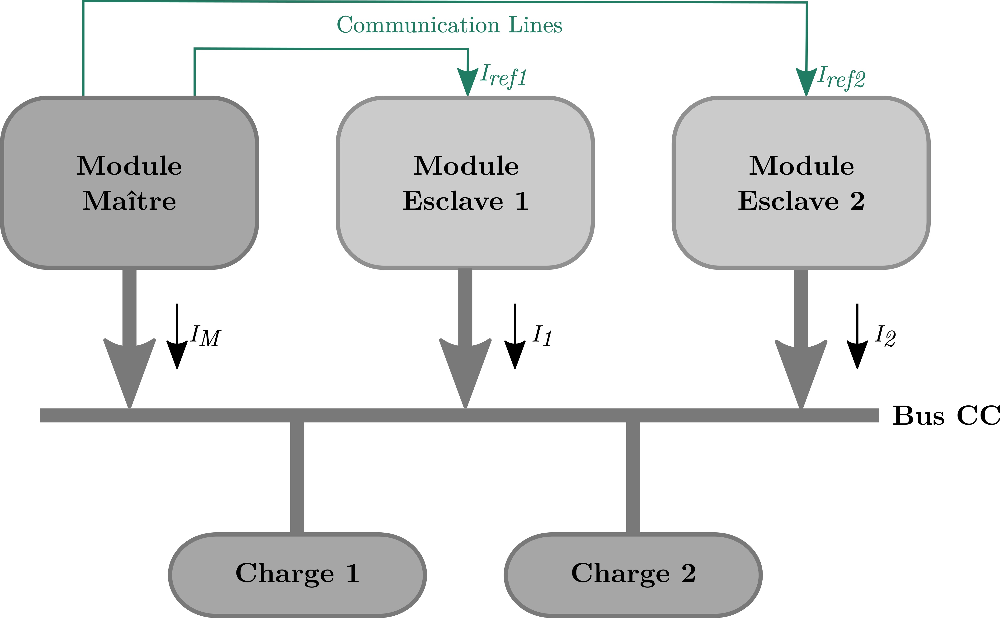

Title: Current Control Experiment with Analog Communication - Code Example

## Overview

This code example demonstrates a current control experiment utilizing analog communication between a master board and multiple slave boards. The master board operates in voltage control mode and sends current references to the slave boards, which work in current control mode. The goal is to regulate and synchronize current injection into an electrical network.

## Experimental Setup

- Two boards are used: a **master** board and one or more **slave** boards.
- The master board generates current references and communicates them to the slave boards via analog communication. [Communication Current Mode](https://gitlab.laas.fr/afarahhass/Test-Controle/-/tree/main_Communication_CurrentMode?ref_type=heads)
- Synchronization modules ensure coordination of PWM signals between master and slave boards.
- Compensation control is utilized to equilibrate current between different legs of the system. [compensation control](https://gitlab.laas.fr/afarahhass/Test-Controle/-/tree/main_CurrentMode_EqulibrateCurrent)

| Connexion diagram | Microgrid structure |
| ------ | ------ |
|  | |

## Communication Modules

### 1. Analog Communication

Analog communication facilitates the exchange of peak current references from the master board to the slave boards. This communication allows for current regulation and control within the system.

### 2. Synchronization

Synchronization modules ensure that PWM signals are aligned and coordinated between the master and slave boards. This synchronization is crucial for maintaining accurate current control and injection.

## Code Usage

1. Upload `src/main.cpp` to the master board and each slave board.
2. In the `main.cpp` file, navigate to line 114 to find the macro definition:

   ```cpp
   #define MASTER
   ```

   Replace this macro with one of the following options based on the board you are flashing:

   For a slave board:
   ```cpp
   #define SLAVE
   ```
   
   or
   
   ```cpp
   #define SLAVE2
   ```

## Example Workflow

1. **Master Board Operation:**
   - The master board operates in voltage control mode.
   - It generates current references within the 0-4000 range.
   - Using analog communication, it sends these references to the slave board(s).

2. **Slave Board Operation:**
   - Each slave board operates in current control mode.
   - It continuously monitors the analog communication from the master board.
   - The slave board extracts the current reference and injects it into the electrical network.
   - Compensation control ensures balanced current distribution among the system's legs.

3. **Synchronization:**
   - The synchronization modules guarantee that PWM signals are coordinated between the master and slave boards.
   - This synchronization is vital for maintaining accurate and synchronized current injection.

## Conclusion

This code example showcases a current control experiment that employs analog communication between a master board and multiple slave boards. By following the provided instructions and flashing the appropriate code, you can simulate and observe the regulation and synchronization of current injection into an electrical network. The combination of voltage control, current control, analog communication, and synchronization modules results in an efficient and coordinated system for current regulation.


