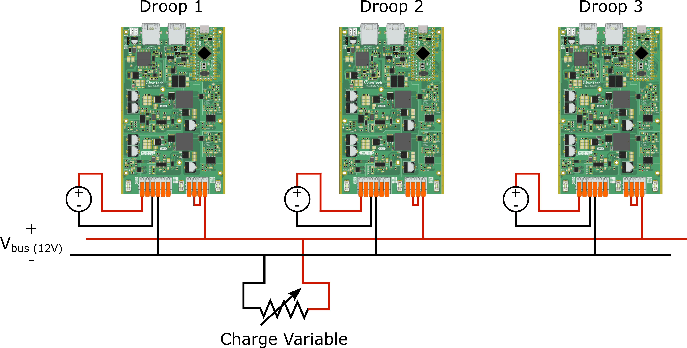
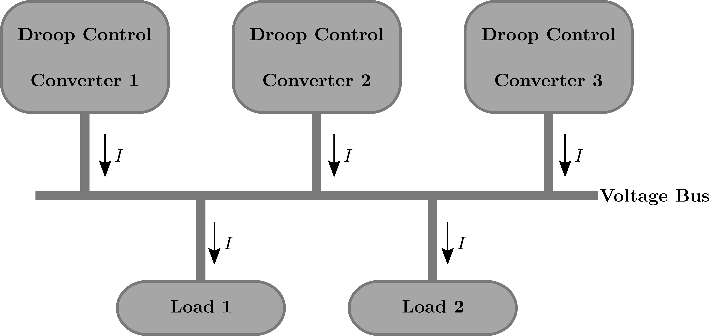

Title: Parallel Power Conversion Experiment - Code Example

## Overview

This code example demonstrates an experiment involving three power converters connected in parallel to power a DC bus without communication. Each converter performs power conversion in buck mode and is programmed with a distinct droop factor (1.2, 1.1, and 1.6 respectively). The experiment aims to explore the behavior of parallel power conversion and observe the impact of different droop factors on the voltage regulation.

## Experimental Setup

- Three power converters are connected in parallel to the DC bus.
- Each power converter operates in voltage control mode and performs power conversion in buck mode.
- Individual droop factors of 1.2, 1.1, and 1.6 are programmed for the respective cards.

| Connexion diagram | Microgrid structure |
| ------ | ------ |
|   | |


## Code Usage

1. Flash `src/main.cpp` to each of the power converters.
2. In the `main.cpp` file, go to line 80 to find the macro definition:

   ```cpp
   #define DROOP
   ```

   Replace this macro with the relevant option for the board you are flashing:

   For a different board:
   ```cpp
   #define DROOP1
   ```
   
   or
   
   ```cpp
   #define DROOP2
   ```

## Example Workflow

1. **Parallel Power Conversion:**
   - Three power converters are interconnected in parallel to supply power to the DC bus.
   - Each converter performs power conversion using a buck mode.
   - Individual droop factors (1.2, 1.1, and 1.6) are applied to each converter.

2. **Voltage Regulation:**
   - Monitor the behavior of the parallel power conversion system and observe how it manages voltage regulation under different conditions.
   - Analyze the role of each card's droop factor in distributing the load and regulating the voltage on the DC bus.

## Conclusion

By following the provided guidelines and uploading the code to the power cards, you can emulate and study the dynamics of parallel power conversion in buck mode. This experiment allows you to investigate the impact of varied droop factors on voltage regulation and observe how the power cards work together in parallel to provide power to the DC bus. The combination of voltage control, buck mode operation, and unique droop factors contributes to an efficient and synchronized power conversion system.

